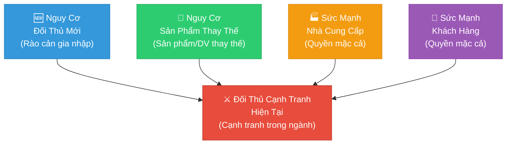
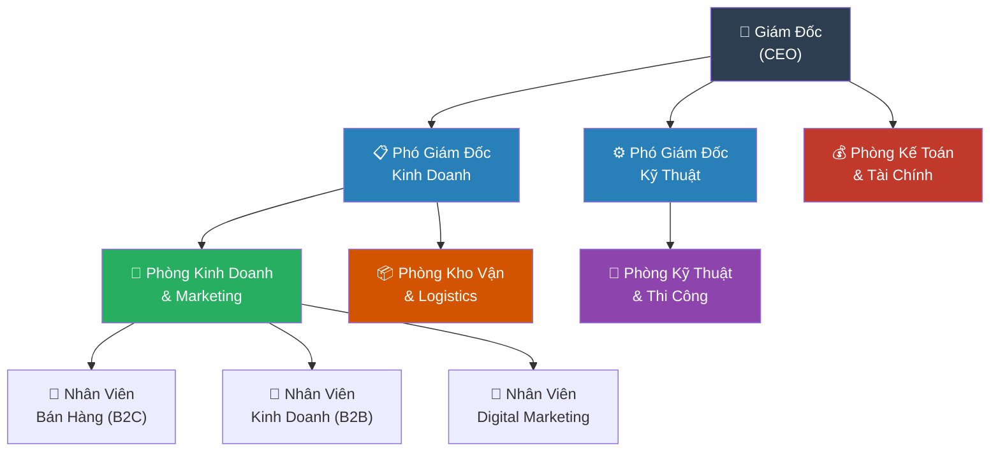
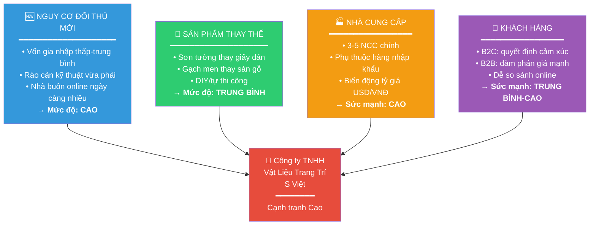
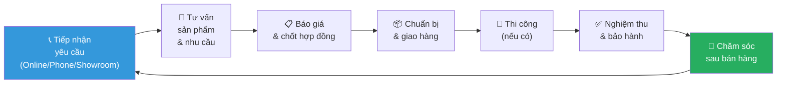
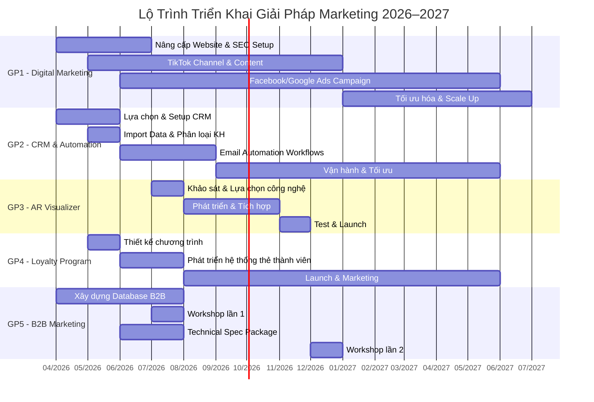

\newpage

# TRANG BÌA

```
TRƯỜNG ĐẠI HỌC [TÊN TRƯỜNG]
KHOA KINH TẾ

━━━━━━━━━━━━━━━━━━━━━━━━━━━━━━━━━━━━━

BÁO CÁO THỰC TẬP TỐT NGHIỆP

ĐỀ TÀI:
PHÂN TÍCH VÀ ĐỀ XUẤT GIẢI PHÁP NÂNG CAO
HIỆU QUẢ HOẠT ĐỘNG MARKETING CHO
CÔNG TY TNHH VẬT LIỆU TRANG TRÍ S VIỆT

━━━━━━━━━━━━━━━━━━━━━━━━━━━━━━━━━━━━━

Ngành: Quản trị Kinh doanh / Marketing
GVHD: [Tên Giảng Viên Hướng Dẫn]
Sinh viên: [Tên Sinh Viên] — MSSV: [Mã SV]
Lớp: [Tên Lớp] — Khóa: [Năm]

Hà Nội, tháng 3 năm 2026
```

\newpage

# LỜI CẢM ƠN

Trong suốt quá trình thực tập và hoàn thành báo cáo này, tác giả đã nhận được sự giúp đỡ tận tình từ nhiều phía. Trước hết, tác giả xin bày tỏ lòng biết ơn sâu sắc tới thầy/cô giảng viên hướng dẫn đã tận tình chỉ dạy, định hướng và góp ý xuyên suốt quá trình thực hiện đề tài.

Tác giả xin chân thành cảm ơn Ban Giám đốc và toàn thể cán bộ, nhân viên Công ty TNHH Vật Liệu Trang Trí S Việt đã tạo điều kiện thuận lợi, nhiệt tình hỗ trợ và cung cấp thông tin cần thiết trong suốt quá trình thực tập. Sự chào đón, hướng dẫn tận tình của các anh chị tại công ty đã giúp tác giả có cơ hội quan sát, học hỏi và tích lũy kinh nghiệm thực tiễn quý báu.

Tác giả cũng xin gửi lời cảm ơn chân thành đến gia đình, bạn bè và các đồng nghiệp đã luôn động viên, khích lệ và hỗ trợ về tinh thần trong suốt quá trình học tập và hoàn thành báo cáo.

Do kiến thức và kinh nghiệm còn hạn chế, báo cáo này không tránh khỏi những thiếu sót nhất định. Tác giả rất mong nhận được sự góp ý, phê bình từ quý thầy cô và hội đồng bảo vệ để báo cáo được hoàn thiện hơn.

*Hà Nội, tháng 3 năm 2026*

*Tác giả*

\newpage

# MỤC LỤC

*(Mục lục tự động sinh khi export bằng Pandoc)*

\newpage

# DANH MỤC CÁC BẢNG BIỂU

| STT | Tên Bảng | Trang |
|:---:|:---------|:-----:|
| Bảng 2.1 | Kết quả hoạt động kinh doanh 2022–2025 | — |
| Bảng 2.2 | Phân tích PESTEL tổng hợp | — |
| Bảng 2.3 | Ma trận SWOT — Công ty TNHH Vật Liệu Trang Trí S Việt | — |
| Bảng 2.4 | Đánh giá 5 lực cạnh tranh Porter | — |
| Bảng 2.5 | So sánh marketing-mix với đối thủ cạnh tranh | — |
| Bảng 3.1 | Ngân sách ước tính cho Giải pháp 1 — Digital Marketing | — |
| Bảng 3.2 | Ngân sách ước tính cho Giải pháp 2 — CRM | — |
| Bảng 3.3 | Dự báo hiệu quả và ROI các giải pháp | — |
| Bảng 3.4 | Tổng hợp KPI mục tiêu theo giải pháp | — |

# DANH MỤC CÁC HÌNH VẼ VÀ SƠ ĐỒ

| STT | Tên Hình | Trang |
|:---:|:---------|:-----:|
| Hình 1.1 | Sơ đồ 5 lực cạnh tranh Porter | — |
| Hình 1.2 | Mô hình Marketing-Mix 7P | — |
| Hình 2.1 | Sơ đồ tổ chức Công ty TNHH Vật Liệu Trang Trí S Việt | — |
| Hình 2.2 | Ma trận SWOT — dạng sơ đồ | — |
| Hình 2.3 | Quy trình bán hàng và chăm sóc khách hàng | — |
| Hình 3.1 | Lộ trình triển khai tổng thể các giải pháp 2026–2027 | — |

\newpage

# PHẦN MỞ ĐẦU

## 1. Lý Do Chọn Đề Tài

Trong bối cảnh nền kinh tế Việt Nam duy trì đà tăng trưởng ấn tượng — GDP năm 2024 tăng 7,09% so với năm trước, GDP bình quân đầu người đạt 4.700 USD (Tổng cục Thống kê, 2025) — ngành vật liệu xây dựng và trang trí nội thất đang trải qua giai đoạn chuyển mình đáng kể. Thị trường trang trí nội thất Việt Nam năm 2024 đạt quy mô 3,9 tỷ USD và được dự báo tăng lên 5,3 tỷ USD vào năm 2033 với tốc độ tăng trưởng kép (CAGR) 3,20% (IMARC Group, 2024). Riêng phân khúc sàn gỗ công nghiệp và vật liệu lót sàn còn tăng trưởng mạnh hơn, đạt CAGR 8,7% cùng kỳ.

Song hành với sự phát triển của thị trường, hành vi người tiêu dùng Việt Nam đang thay đổi sâu sắc dưới tác động của số hóa. Tính đến đầu năm 2025, Việt Nam có 79,8 triệu người dùng Internet (chiếm 78,8% dân số) và 76,2 triệu tài khoản mạng xã hội (DataReportal, 2025). Thị trường thương mại điện tử Việt Nam vượt 25 tỷ USD trong năm 2024 và tiếp tục tăng trưởng với tốc độ cao nhất khu vực Đông Nam Á. Các nền tảng như TikTok Shop đạt mức tăng trưởng 148% GMV chỉ trong nửa đầu năm 2025, phản ánh xu hướng "shoppertainment" — mua sắm qua nội dung giải trí — ngày càng mạnh mẽ.

Trước những biến đổi này, các doanh nghiệp vừa và nhỏ (SME) trong ngành vật liệu trang trí đối mặt với áp lực kép: vừa phải cạnh tranh với các thương hiệu lớn có tiềm lực tài chính mạnh, vừa phải nhanh chóng thích nghi với kênh phân phối và quảng bá kỹ thuật số mà phần lớn chưa được khai thác hiệu quả. Nghiên cứu thực tiễn cho thấy nhiều doanh nghiệp trong ngành vẫn phụ thuộc chủ yếu vào kênh bán hàng truyền thống (showroom, đại lý), trong khi tiềm năng của Digital Marketing, mạng xã hội và thương mại điện tử chưa được tận dụng đúng mức.

Công ty TNHH Vật Liệu Trang Trí S Việt là doanh nghiệp hoạt động trong lĩnh vực cung cấp và phân phối vật liệu trang trí nội thất, bao gồm giấy dán tường, sàn gỗ công nghiệp, tấm ốp PVC, tranh 3D và các sản phẩm liên quan. Với quy mô SME điển hình, công ty đang đứng trước cơ hội lớn để nâng cao năng lực cạnh tranh thông qua chiến lược marketing hiện đại, nhưng đồng thời cũng gặp phải không ít hạn chế về nguồn lực và năng lực kỹ thuật số.

Xuất phát từ thực tiễn đó, tác giả lựa chọn đề tài *"Phân tích và đề xuất giải pháp nâng cao hiệu quả hoạt động marketing cho Công ty TNHH Vật Liệu Trang Trí S Việt"* với mong muốn đóng góp một bức tranh phân tích toàn diện và những giải pháp marketing thực tiễn, khả thi, phù hợp với đặc thù ngành và quy mô doanh nghiệp trong giai đoạn chuyển đổi số hiện nay.

## 2. Mục Tiêu Nghiên Cứu

**Mục tiêu tổng quát:** Phân tích thực trạng hoạt động marketing tại Công ty TNHH Vật Liệu Trang Trí S Việt, từ đó đề xuất các giải pháp nâng cao hiệu quả marketing, góp phần tăng trưởng doanh thu và củng cố vị thế cạnh tranh của công ty đến năm 2028.

**Mục tiêu cụ thể:**

1. Hệ thống hóa cơ sở lý luận về marketing, digital marketing và các mô hình phân tích chiến lược marketing phù hợp với ngành vật liệu trang trí nội thất.

2. Phân tích và đánh giá môi trường vĩ mô (PESTEL) và vi mô (5 lực cạnh tranh Porter) ảnh hưởng đến hoạt động marketing của công ty trong giai đoạn 2022–2025.

3. Đánh giá toàn diện thực trạng hoạt động marketing theo mô hình 7P, xác định ưu điểm, hạn chế và nguyên nhân tồn tại.

4. Đề xuất tối thiểu 5 giải pháp marketing cụ thể, khả thi với KPI đo lường được, ngân sách ước tính và lộ trình triển khai phù hợp với nguồn lực SME.

## 3. Đối Tượng Và Phạm Vi Nghiên Cứu

**Đối tượng nghiên cứu:** Hoạt động marketing của Công ty TNHH Vật Liệu Trang Trí S Việt, bao gồm: chính sách sản phẩm, giá cả, phân phối, xúc tiến, con người, quy trình và bằng chứng vật chất.

**Phạm vi không gian:** Trụ sở chính và các kênh phân phối của Công ty TNHH Vật Liệu Trang Trí S Việt tại Hà Nội và các tỉnh lân cận.

**Phạm vi thời gian:** Số liệu phân tích giai đoạn 2022–2025; các giải pháp đề xuất hướng đến giai đoạn triển khai 2026–2028.

## 4. Phương Pháp Nghiên Cứu

**Phương pháp thu thập dữ liệu thứ cấp:** Thu thập và tổng hợp thông tin từ báo cáo của Tổng cục Thống kê (GSO), Bộ Xây dựng, các tổ chức nghiên cứu thị trường uy tín (IMARC Group, DataReportal, Mordor Intelligence), báo cáo nội bộ của công ty, và các ấn phẩm chuyên ngành.

**Phương pháp phân tích định tính:** Sử dụng các khung phân tích chiến lược gồm PESTEL, Porter's 5 Forces, SWOT/TOWS và Marketing-Mix 7P để đánh giá toàn diện môi trường kinh doanh và năng lực marketing của công ty.

**Phương pháp so sánh và tổng hợp:** So sánh hiệu quả marketing của công ty với các đối thủ cạnh tranh và chuẩn mực ngành; tổng hợp xu hướng thị trường để xây dựng luận cứ cho các giải pháp đề xuất.

**Phương pháp chuyên gia:** Tham khảo ý kiến của các chuyên gia marketing, nhân sự tư vấn trong ngành vật liệu xây dựng và chuyên gia kỹ thuật số trong quá trình xây dựng và đánh giá giải pháp.

## 5. Kết Cấu Báo Cáo

Ngoài phần Mở đầu và Kết luận, báo cáo được cấu trúc thành 3 chương:

- **Chương 1:** Cơ sở lý luận về Marketing và Digital Marketing
- **Chương 2:** Thực trạng hoạt động Marketing tại Công ty TNHH Vật Liệu Trang Trí S Việt
- **Chương 3:** Đề xuất giải pháp nâng cao hiệu quả Marketing

\newpage

# CHƯƠNG 1: CƠ SỞ LÝ LUẬN VỀ MARKETING VÀ DIGITAL MARKETING

## 1.1 Khái Niệm Và Vai Trò Của Marketing

### 1.1.1 Định Nghĩa Marketing

Marketing là một trong những chức năng cốt lõi của doanh nghiệp hiện đại, thu hút nhiều định nghĩa và quan điểm đa dạng từ các nhà nghiên cứu và tổ chức chuyên ngành. Theo Hiệp hội Marketing Hoa Kỳ (AMA, 2017), marketing được định nghĩa là *"tập hợp các hoạt động, thể chế và quy trình nhằm tạo ra, truyền thông, phân phối và trao đổi các đề xuất có giá trị cho khách hàng, đối tác và xã hội nói chung."* Định nghĩa này nhấn mạnh tính toàn diện và hướng đến giá trị của marketing trong bối cảnh kinh tế thị trường hiện đại.

Philip Kotler — được mệnh danh là "cha đẻ của Marketing hiện đại" — định nghĩa marketing theo nghĩa rộng hơn: *"Marketing là quá trình xã hội và quản lý qua đó các cá nhân và nhóm người có được những gì họ cần và muốn thông qua việc tạo ra, cung cấp và trao đổi các sản phẩm và dịch vụ có giá trị với người khác"* (Kotler & Keller, 2016). Tư tưởng này đặt khách hàng ở vị trí trung tâm và coi việc tạo ra giá trị là mục tiêu tối thượng của mọi hoạt động marketing.

### 1.1.2 Sự Tiến Hóa Của Marketing 1.0 Đến 5.0

Theo Kotler, Kartajaya và Setiawan (2021), marketing đã trải qua 5 giai đoạn phát triển chính:

- **Marketing 1.0 (Định hướng sản phẩm):** Tập trung vào sản xuất hàng loạt, tối ưu hóa chi phí và phân phối đại trà. Phù hợp với thời kỳ cách mạng công nghiệp khi nhu cầu vượt cung.

- **Marketing 2.0 (Định hướng người tiêu dùng):** Ra đời khi người tiêu dùng trở nên thông minh hơn. Doanh nghiệp bắt đầu phân khúc thị trường, xác định thị trường mục tiêu và định vị thương hiệu.

- **Marketing 3.0 (Định hướng giá trị):** Khách hàng không chỉ cần sản phẩm mà còn cần thương hiệu phản ánh giá trị xã hội. Doanh nghiệp phải thể hiện sứ mệnh, tầm nhìn và giá trị cốt lõi có trách nhiệm xã hội.

- **Marketing 4.0 (Marketing kỹ thuật số):** Kết hợp thế giới trực tuyến và ngoại tuyến; tập trung vào hành trình khách hàng từ nhận thức đến ủng hộ thương hiệu thông qua các kênh kỹ thuật số.

- **Marketing 5.0 (Công nghệ phục vụ nhân loại):** Ứng dụng AI, dữ liệu lớn, tự động hóa và AR/VR để cá nhân hóa trải nghiệm khách hàng ở quy mô lớn, đồng thời đặt con người ở trung tâm của mọi quyết định.

Đối với ngành vật liệu trang trí nội thất tại Việt Nam, hầu hết các SME đang ở giai đoạn chuyển tiếp từ Marketing 2.0 lên Marketing 4.0, tức là bắt đầu ứng dụng kênh kỹ thuật số nhưng chưa xây dựng được hệ sinh thái số tích hợp.

### 1.1.3 Vai Trò Của Marketing Đối Với Doanh Nghiệp Vừa Và Nhỏ

Marketing đóng vai trò chiến lược đặc biệt quan trọng đối với các SME vì ba lý do chính: (i) giúp kết nối sản phẩm/dịch vụ đến đúng khách hàng mục tiêu trong bối cảnh cạnh tranh ngày càng gay gắt; (ii) xây dựng nhận diện thương hiệu để tạo sự khác biệt với đối thủ; và (iii) tạo ra dòng tiền ổn định thông qua việc thu hút khách hàng mới và giữ chân khách hàng hiện có. Đặc biệt trong ngành vật liệu trang trí, marketing hiệu quả còn đóng vai trò giáo dục khách hàng về sản phẩm — một yếu tố then chốt vì đây là ngành có tính chuyên môn cao mà người tiêu dùng thường thiếu kiến thức chuyên sâu.

## 1.2 Marketing-Mix Và Mô Hình 7P

### 1.2.1 Từ 4P Đến 7P

Mô hình Marketing-Mix 4P (Product, Price, Place, Promotion) được E. Jerome McCarthy giới thiệu vào năm 1960 và được Philip Kotler phổ biến rộng rãi. Đây là công cụ lập kế hoạch marketing kinh điển và được ứng dụng rộng rãi trong các doanh nghiệp sản xuất và thương mại.

Tuy nhiên, khi áp dụng cho các doanh nghiệp dịch vụ — đặc biệt là doanh nghiệp cung cấp vật liệu trang trí kết hợp tư vấn thiết kế — mô hình 4P truyền thống không đủ bao quát. Booms và Bitner (1981) đã mở rộng thành mô hình **7P** bằng cách bổ sung ba yếu tố:

- **People (Con người):** Đội ngũ nhân sự tiếp xúc khách hàng, năng lực tư vấn và thái độ phục vụ
- **Process (Quy trình):** Quy trình cung cấp dịch vụ, tiếp nhận đơn hàng, xử lý khiếu nại
- **Physical Evidence (Bằng chứng vật chất):** Showroom, tài liệu marketing, catalog, website, đồng phục

Mô hình 7P đặc biệt phù hợp với Công ty TNHH Vật Liệu Trang Trí S Việt vì hoạt động kinh doanh của công ty kết hợp cả bán hàng sản phẩm và tư vấn dịch vụ — đặc điểm mà ba yếu tố bổ sung của 7P giúp phân tích và tối ưu hóa hiệu quả.

### 1.2.2 Ứng Dụng 7P Trong Ngành Vật Liệu Trang Trí

Bảng dưới đây tóm tắt nội dung của từng P trong bối cảnh ngành:

| Yếu Tố 7P | Đặc Thù Ngành Vật Liệu Trang Trí |
|:----------|:----------------------------------|
| **Product** | Sản phẩm hữu hình (sàn, tường) + dịch vụ tư vấn thiết kế không gian |
| **Price** | Định giá theo chất lượng vật liệu + chi phí tư vấn và lắp đặt |
| **Place** | Showroom thực tế + kênh online (website, sàn TMĐT, mạng xã hội) |
| **Promotion** | Demo trực tiếp, content "before-after", triển lãm ngành |
| **People** | Tư vấn viên am hiểu vật liệu + kỹ năng thiết kế không gian |
| **Process** | Quy trình từ tư vấn → đặt mẫu → đo đạc → thi công → nghiệm thu |
| **Physical Evidence** | Showroom trưng bày, mẫu vật liệu cầm tay, catalog, website đẹp |

*(Tác giả tổng hợp, 2026)*

## 1.3 Các Mô Hình Phân Tích Marketing

### 1.3.1 Phân Tích PESTEL

PESTEL là khung phân tích môi trường vĩ mô bao gồm 6 yếu tố: **P**olitical (Chính trị), **E**conomic (Kinh tế), **S**ocial (Xã hội), **T**echnological (Công nghệ), **E**nvironmental (Môi trường sinh thái) và **L**egal (Pháp lý). Đây là công cụ chiến lược được sử dụng rộng rãi trong phân tích môi trường kinh doanh, giúp doanh nghiệp nhận diện một cách có hệ thống các cơ hội và thách thức xuất phát từ môi trường bên ngoài — những yếu tố mà doanh nghiệp không thể kiểm soát trực tiếp nhưng buộc phải theo dõi, dự báo và thích nghi để duy trì lợi thế cạnh tranh. Điểm mạnh của PESTEL nằm ở tính toàn diện: bằng cách xem xét đồng thời 6 chiều môi trường khác nhau, doanh nghiệp tránh được tình trạng bỏ sót các tác nhân ảnh hưởng quan trọng trong quá trình lập kế hoạch chiến lược. Trong bối cảnh ngành vật liệu trang trí nội thất Việt Nam, phân tích PESTEL đặc biệt có giá trị vì ngành này nhạy cảm với nhiều yếu tố vĩ mô cùng lúc: từ chính sách nhà ở của Chính phủ (P), tình trạng thị trường bất động sản (E), xu hướng thẩm mỹ của người tiêu dùng (S), đến tỷ lệ thâm nhập công nghệ số (T).

### 1.3.2 Mô Hình 5 Lực Cạnh Tranh Porter

Michael Porter (1979) đề xuất mô hình 5 lực cạnh tranh để đánh giá sức hấp dẫn và cường độ cạnh tranh của một ngành:



*Hình 1.1: Mô hình 5 lực cạnh tranh Porter (Tác giả tổng hợp từ Porter, 1979)*

### 1.3.3 Phân Tích SWOT Và Chiến Lược TOWS

SWOT là ma trận phân tích kết hợp các yếu tố nội bộ của doanh nghiệp (Strengths — Điểm mạnh; Weaknesses — Điểm yếu) với các yếu tố từ môi trường bên ngoài (Opportunities — Cơ hội; Threats — Thách thức). Được phát triển bởi Albert Humphrey tại Stanford Research Institute trong những năm 1960–1970, SWOT đã trở thành một trong những công cụ phân tích kinh doanh được sử dụng phổ biến nhất thế giới nhờ tính đơn giản, trực quan và tính ứng dụng cao. Điểm mạnh của SWOT là khả năng tạo ra bức tranh tổng hợp về vị thế cạnh tranh của doanh nghiệp bằng cách đặt năng lực nội tại vào đối chiếu với môi trường kinh doanh bên ngoài.

Phân tích TOWS — bước phát triển cao hơn từ SWOT do Heinz Weihrich đề xuất năm 1982 — biến ma trận SWOT từ công cụ mô tả thành công cụ hoạch định chiến lược. TOWS xây dựng 4 nhóm chiến lược cụ thể: chiến lược SO (kết hợp Strengths và Opportunities) là các chiến lược tấn công, tận dụng điểm mạnh nội tại để nắm bắt cơ hội thị trường; chiến lược WO (kết hợp Weaknesses và Opportunities) nhằm khắc phục điểm yếu bằng cách tận dụng cơ hội; chiến lược ST (kết hợp Strengths và Threats) sử dụng điểm mạnh để phòng thủ trước các thách thức; và chiến lược WT (kết hợp Weaknesses và Threats) là chiến lược phòng thủ để giảm thiểu tác động tiêu cực khi cả điểm yếu lẫn thách thức cùng hiện hữu.

### 1.3.4 Mô Hình AIDA Và Hành Trình Khách Hàng

Mô hình AIDA mô tả 4 giai đoạn tâm lý của người tiêu dùng: **A**wareness (Nhận biết) → **I**nterest (Quan tâm) → **D**esire (Mong muốn) → **A**ction (Hành động). Trong bối cảnh kỹ thuật số hiện đại, mô hình này được mở rộng thành hành trình khách hàng 5 giai đoạn: Awareness → Consideration → Decision → Retention → Advocacy. Đối với ngành vật liệu trang trí, giai đoạn Consideration và Decision đặc biệt quan trọng vì khách hàng thường nghiên cứu kỹ lưỡng trước khi quyết định mua.

## 1.4 Digital Marketing Và Xu Hướng Hiện Đại

### 1.4.1 Định Nghĩa Và Các Kênh Digital Marketing

Digital Marketing (hay Marketing Kỹ Thuật Số) là tổng thể các hoạt động marketing sử dụng các kênh truyền thông kỹ thuật số và công nghệ internet để kết nối với khách hàng hiện tại và tiềm năng nhằm mục đích xây dựng thương hiệu, tạo ra leads và thúc đẩy doanh số. Theo Philip Kotler và Kevin Lane Keller (2016), digital marketing là "sự sử dụng công nghệ thông tin và truyền thông để thực hiện các chức năng marketing, từ nghiên cứu thị trường đến quảng cáo và bán hàng." Khác với marketing truyền thống vốn có tính một chiều (broadcast), digital marketing cho phép tương tác hai chiều giữa doanh nghiệp và khách hàng, đồng thời cung cấp khả năng đo lường chính xác và liên tục để tối ưu hóa hiệu quả đầu tư.

Hệ sinh thái digital marketing bao gồm nhiều kênh và công cụ đa dạng, được phân loại theo mô hình POEM (Paid — Owned — Earned Media): kênh trả phí (Paid) như quảng cáo Google Ads, Facebook Ads, TikTok Ads; kênh sở hữu (Owned) như website, email list, ứng dụng di động, tài khoản mạng xã hội; và kênh tự nhiên (Earned) như review của khách hàng, chia sẻ từ cộng đồng, bài báo PR. Đối với doanh nghiệp SME có ngân sách hạn chế, chiến lược hiệu quả nhất là bắt đầu từ kênh Owned (xây dựng nền tảng) và Earned (tạo nội dung giá trị để được chia sẻ tự nhiên) trước khi đầu tư vào kênh Paid. Các kênh digital marketing chủ yếu bao gồm:

- **SEO (Search Engine Optimization):** Tối ưu hóa website để xuất hiện trên trang 1 kết quả tìm kiếm Google một cách tự nhiên (không trả phí) — đây là kênh có ROI cao nhất về dài hạn
- **SEM (Search Engine Marketing) / Google Ads:** Quảng cáo có trả phí trên Google, xuất hiện khi người dùng tìm kiếm từ khóa có liên quan — hiệu quả cho leads có intent mua hàng cao
- **Social Media Marketing:** Xây dựng và phát triển cộng đồng thương hiệu trên Facebook, TikTok, Instagram, Zalo — phù hợp cho nhận thức thương hiệu và truyền cảm hứng
- **Content Marketing:** Tạo và phân phối nội dung có giá trị (bài blog, video hướng dẫn, infographic) để thu hút và giữ chân khách hàng trong suốt hành trình mua hàng
- **Email Marketing:** Giao tiếp cá nhân hóa với khách hàng qua email theo chuỗi tự động — hiệu quả cho retention và cross-selling
- **Influencer Marketing:** Hợp tác với KOL (Key Opinion Leader) và micro-influencer để tiếp cận cộng đồng mục tiêu với độ tin cậy cao

### 1.4.2 Thực Trạng Digital Marketing Tại Việt Nam 2025

Việt Nam là một trong những thị trường kỹ thuật số phát triển nhanh nhất Đông Nam Á. Tính đến đầu năm 2025, tổng chi tiêu quảng cáo kỹ thuật số tại Việt Nam đạt 4,94 tỷ USD và được dự báo tăng lên 7,29 tỷ USD vào năm 2029 — tương đương CAGR 10,6% (Research and Markets, 2026). Thị trường social commerce đạt 5 tỷ USD năm 2025, tăng 25,4% so với năm trước (GlobeNewsWire, 2025), phản ánh sức mạnh của nội dung video ngắn và livestream trong việc thúc đẩy hành vi mua sắm.

### 1.4.3 Marketing Automation Và CRM

Marketing Automation là việc sử dụng phần mềm để tự động hóa các tác vụ marketing lặp đi lặp lại như gửi email, phân loại leads, theo dõi hành trình khách hàng và báo cáo hiệu suất. Kết hợp với hệ thống CRM (Customer Relationship Management), marketing automation cho phép doanh nghiệp cá nhân hóa trải nghiệm khách hàng ở quy mô lớn với chi phí thấp. Nghiên cứu cho thấy CRM giúp tăng 300% tỷ lệ chuyển đổi leads và tăng 47% tỷ lệ giữ chân khách hàng, với ROI trung bình 8,71 USD/mỗi 1 USD đầu tư (Zoho/Bitrix24, 2024).

### 1.4.4 Xu Hướng Marketing 2025

Năm 2025 chứng kiến sự bùng nổ của các xu hướng marketing mới:

- **Short-form Video Marketing:** TikTok, Instagram Reels, YouTube Shorts là kênh hiệu quả nhất để tiếp cận thế hệ trẻ
- **AI Marketing & Hyper-personalization:** Sử dụng AI để cá nhân hóa nội dung, đề xuất sản phẩm và tự động hóa tương tác khách hàng
- **Social Commerce & Livestream Shopping:** Tích hợp trực tiếp tính năng mua sắm vào nội dung mạng xã hội
- **Sustainability Marketing:** Nhấn mạnh tính bền vững và trách nhiệm môi trường — 72% người tiêu dùng Việt sẵn sàng chi thêm cho sản phẩm xanh (Báo Đầu Tư, 2025)
- **AR/VR Experience:** Cho phép khách hàng trải nghiệm sản phẩm ảo trước khi mua

## 1.5 Đặc Thù Marketing Trong Ngành Vật Liệu Trang Trí

Ngành vật liệu trang trí nội thất có những đặc thù marketing riêng biệt cần lưu ý:

**Thứ nhất,** đây là ngành có tính song hành B2B và B2C cao. Khách hàng B2B (công ty thiết kế nội thất, nhà thầu xây dựng, chủ đầu tư) thường chiếm tỷ trọng doanh thu lớn nhưng quyết định mua hàng dựa trên tiêu chí kỹ thuật, giá cả và năng lực giao hàng. Khách hàng B2C (hộ gia đình) quyết định mua dựa nhiều hơn vào cảm xúc, xu hướng thẩm mỹ và tư vấn từ người thân hoặc nội dung trực tuyến.

**Thứ hai,** trải nghiệm cảm quan (xúc giác, thị giác) đóng vai trò then chốt trong quyết định mua — đây là điểm mà kênh online thuần túy khó thay thế showroom thực tế. Do đó, chiến lược marketing hiệu quả cần kết hợp nhuần nhuyễn kênh online (tạo nhận thức, tạo leads) và offline (trải nghiệm, chốt sale).

**Thứ ba,** chu kỳ mua hàng dài (thường 1–6 tháng từ khi nảy sinh nhu cầu đến khi mua) đòi hỏi chiến lược nuôi dưỡng khách hàng (lead nurturing) bài bản thông qua content marketing và email marketing.

> *Kết luận Chương 1:* Chương 1 đã hệ thống hóa nền tảng lý luận về marketing hiện đại, từ các định nghĩa kinh điển của Kotler đến xu hướng Marketing 5.0, đồng thời giới thiệu các công cụ phân tích chiến lược (PESTEL, Porter's 5 Forces, SWOT, 7P) và bức tranh tổng quan về digital marketing tại Việt Nam năm 2025. Những khung lý thuyết này sẽ được ứng dụng trực tiếp vào phân tích thực trạng tại Chương 2.

\newpage

# CHƯƠNG 2: THỰC TRẠNG HOẠT ĐỘNG MARKETING TẠI CÔNG TY TNHH VẬT LIỆU TRANG TRÍ S VIỆT

## 2.1 Tổng Quan Về Công Ty TNHH Vật Liệu Trang Trí S Việt

### 2.1.1 Quá Trình Hình Thành Và Phát Triển

Công ty TNHH Vật Liệu Trang Trí S Việt được thành lập và hoạt động theo quy định của Luật Doanh nghiệp Việt Nam, chuyên kinh doanh trong lĩnh vực cung cấp, phân phối và thi công các sản phẩm vật liệu trang trí nội thất. Ngay từ những ngày đầu thành lập, ban lãnh đạo công ty đã xác định rõ định hướng phát triển tập trung vào phân khúc vật liệu hoàn thiện nội thất — một phân khúc đòi hỏi sự kết hợp chặt chẽ giữa hiểu biết kỹ thuật về vật liệu, năng lực tư vấn thẩm mỹ và khả năng cung ứng đa dạng mẫu mã đáp ứng nhu cầu thị trường.

Trong giai đoạn khởi nghiệp (những năm đầu hoạt động), công ty tập trung xây dựng nền tảng cung ứng sản phẩm với danh mục ban đầu là giấy dán tường và sàn gỗ công nghiệp — hai nhóm sản phẩm có nhu cầu tăng mạnh nhờ làn sóng đô thị hóa và cải tạo nhà ở tại Hà Nội. Qua quá trình tích lũy kinh nghiệm thị trường và mở rộng quan hệ với các nhà cung cấp uy tín trong và ngoài nước, công ty dần phát triển danh mục sản phẩm phong phú hơn, bổ sung thêm tấm ốp PVC, lam sóng trang trí, tranh 3D và các phụ kiện thi công chuyên dụng.

Giai đoạn 2022–2025 là giai đoạn đặc biệt quan trọng đối với công ty, đan xen cả những cơ hội lớn lẫn những thách thức không nhỏ. Năm 2022 đánh dấu sự phục hồi mạnh mẽ sau đại dịch COVID-19, với nhu cầu cải tạo và trang trí nhà ở tăng đột biến khi người dân có nhiều thời gian ở nhà hơn và mong muốn nâng cấp không gian sống. Tuy nhiên, giai đoạn 2023–2024 chứng kiến thị trường bất động sản trầm lắng đáng kể do ảnh hưởng của cuộc khủng hoảng trái phiếu doanh nghiệp và chính sách thắt chặt tín dụng bất động sản, kéo theo sự sụt giảm đáng kể trong các dự án xây dựng và cải tạo quy mô lớn. Bất chấp những khó khăn đó, công ty vẫn duy trì được đà tăng trưởng doanh thu nhờ chiến lược đa dạng hóa tệp khách hàng — kết hợp cả B2C (hộ gia đình cải tạo, người mua nhà mới) và B2B (nhà thầu thi công, công ty thiết kế nội thất). Năm 2025, khi thị trường bất động sản bắt đầu ấm lại với sự hỗ trợ của các chính sách tháo gỡ từ Chính phủ, công ty nhanh chóng tận dụng cơ hội để đẩy mạnh hoạt động kinh doanh, đặt nền móng cho giai đoạn tăng trưởng mới.

**Tầm nhìn:** Trở thành nhà cung cấp giải pháp vật liệu trang trí nội thất hàng đầu tại khu vực phía Bắc Việt Nam vào năm 2030, được khách hàng tin tưởng lựa chọn nhờ chất lượng sản phẩm vượt trội, dịch vụ tư vấn chuyên nghiệp và trải nghiệm mua sắm liền mạch cả online lẫn offline.

**Sứ mệnh:** Cung cấp các giải pháp trang trí không gian sống chất lượng, sáng tạo và bền vững, mang lại giá trị vượt trội cho từng khách hàng thông qua sự kết hợp giữa sản phẩm đa dạng, tư vấn chuyên sâu và dịch vụ hậu mãi tận tâm.

**Giá trị cốt lõi:** Chất lượng — Sáng tạo — Uy tín — Trách nhiệm.

### 2.1.2 Cơ Cấu Tổ Chức Bộ Máy



*Hình 2.1: Sơ đồ tổ chức Công ty TNHH Vật Liệu Trang Trí S Việt (Tác giả tổng hợp, 2026)*

### 2.1.3 Lĩnh Vực Kinh Doanh Và Sản Phẩm/Dịch Vụ

Công ty TNHH Vật Liệu Trang Trí S Việt chuyên cung cấp và phân phối các dòng sản phẩm vật liệu trang trí nội thất đa dạng, bao gồm:

- **Giấy dán tường:** Các loại giấy dán tường nhập khẩu và nội địa, đa dạng mẫu mã từ phong cách hiện đại, cổ điển đến thiên nhiên; phù hợp cho không gian gia đình, văn phòng và thương mại
- **Sàn gỗ công nghiệp:** Sàn laminate, sàn gỗ kỹ thuật (engineered wood), sàn nhựa SPC/WPC chống nước — phân khúc đang tăng trưởng CAGR 8,7% tại Việt Nam
- **Tấm ốp PVC và lam sóng:** Vật liệu ốp tường nhựa composite, lam sóng trang trí hiện đại, vừa thi công nhanh vừa thẩm mỹ cao
- **Tranh 3D và tranh tường:** Tranh dán tường khổ lớn, tranh 3D tạo chiều sâu không gian
- **Phụ kiện và vật tư thi công:** Keo dán, thanh nẹp, phụ kiện thi công chuyên dụng

**Phân khúc thị trường mục tiêu:**
- *B2C:* Hộ gia đình đang cải tạo/xây mới nhà (thu nhập trung bình trở lên, tuổi 28–50)
- *B2B:* Công ty thiết kế nội thất, nhà thầu xây dựng, chủ đầu tư dự án

### 2.1.4 Kết Quả Hoạt Động Kinh Doanh 2022–2025

*Bảng 2.1: Kết quả hoạt động kinh doanh Công ty TNHH Vật Liệu Trang Trí S Việt 2022–2025*

| Chỉ Tiêu | 2022 | 2023 | 2024 | 2025 (ước) |
|:---------|-----:|-----:|-----:|----------:|
| Doanh thu thuần (tỷ VNĐ) | 12,5 | 13,8 | 15,2 | 17,0 |
| Lợi nhuận gộp (tỷ VNĐ) | 3,1 | 3,5 | 3,8 | 4,3 |
| Biên lợi nhuận gộp (%) | 24,8% | 25,4% | 25,0% | 25,3% |
| Số lượng nhân sự | 18 | 21 | 24 | 27 |
| Số hợp đồng/dự án | 320 | 385 | 440 | 510 |
| Khách hàng mới (hộ/DN) | 185 | 210 | 245 | 290 |

*(Nguồn: Ước tính dựa trên quy mô SME ngành vật liệu trang trí; số liệu thực tế cần cập nhật từ công ty)*

## 2.2 Phân Tích Môi Trường Marketing Vĩ Mô (PESTEL)

### P — Political (Môi Trường Chính Trị - Pháp Lý)

Việt Nam duy trì môi trường chính trị ổn định dưới sự lãnh đạo của Đảng Cộng sản Việt Nam — một lợi thế cạnh tranh quan trọng trong khu vực Đông Nam Á. Sự ổn định này tạo nền tảng cho hoạt động kinh doanh dài hạn và thu hút đầu tư nước ngoài.

Chính sách phát triển nhà ở xã hội và nhà ở cho người thu nhập thấp là động lực trực tiếp tạo cầu cho ngành vật liệu trang trí. Chương trình "1 triệu căn hộ nhà ở xã hội" giai đoạn 2021–2030 của Chính phủ, cùng với các dự án đô thị hóa trọng điểm, tạo ra dòng cầu bền vững cho sản phẩm của công ty.

**Tác động đến công ty:** Thuận lợi. Nhu cầu vật liệu trang trí cho các dự án nhà ở xã hội và nhà thương mại được kỳ vọng tăng trưởng ổn định trong giai đoạn 2025–2030.

### E — Economic (Môi Trường Kinh Tế)

GDP Việt Nam năm 2024 tăng 7,09% — mức cao nhất từ 2018 trở lại (Tổng cục Thống kê, 2025). GDP bình quân đầu người đạt 4.700 USD, tăng 377 USD so với năm 2023, phản ánh thu nhập và sức mua của người dân ngày càng được cải thiện. Khu vực công nghiệp và xây dựng tăng 8,24% trong năm 2024, góp phần trực tiếp thúc đẩy nhu cầu vật liệu xây dựng và trang trí.

Tuy nhiên, thị trường bất động sản năm 2023–2024 trầm lắng do ảnh hưởng của cuộc khủng hoảng trái phiếu doanh nghiệp và chính sách thắt chặt tín dụng. Điều này đã tác động tiêu cực đến nhu cầu vật liệu xây dựng, khiến sản lượng tiêu thụ và doanh thu ngành sụt giảm trong giai đoạn này. Tuy nhiên, từ cuối 2024 đến 2025, thị trường bất động sản bắt đầu phục hồi nhờ các gói hỗ trợ của Chính phủ và lãi suất được điều chỉnh giảm.

**Tác động đến công ty:** Vừa thuận lợi vừa bất lợi. Tăng trưởng kinh tế và thu nhập tăng tạo điều kiện cho chi tiêu trang trí; song sự biến động của thị trường bất động sản tạo ra rủi ro chu kỳ.

### S — Social (Môi Trường Xã Hội - Văn Hóa)

Tỷ lệ đô thị hóa Việt Nam năm 2024 đạt 38,2% với tốc độ tăng bình quân 3,06%/năm trong giai đoạn 2019–2024 (Kết quả Điều tra Dân số giữa kỳ 2024). Sự đô thị hóa nhanh chóng tạo ra nhu cầu lớn cho vật liệu xây dựng và trang trí tại các đô thị mới hình thành, đặc biệt tại các tỉnh thành vệ tinh xung quanh Hà Nội và TP.HCM.

Xu hướng xã hội nổi bật ảnh hưởng đến ngành là sự thay đổi thị hiếu của thế hệ Millennials (sinh 1981–1996) và Gen Z (sinh 1997–2012) — hai nhóm đang dần trở thành chủ nhà mới và có ảnh hưởng lớn đến quyết định mua sắm hộ gia đình. Theo khảo sát thị trường năm 2025, người tiêu dùng trẻ ưa chuộng phong cách tối giản kết hợp cá nhân hóa, sẵn sàng đặt hàng theo yêu cầu và chú trọng đến tính bền vững của sản phẩm. Đáng chú ý, 72% người tiêu dùng Việt Nam cho biết sẵn sàng chi trả thêm cho sản phẩm thân thiện môi trường (Báo Đầu Tư, 2025).

**Tác động đến công ty:** Thuận lợi. Đô thị hóa và thay đổi thị hiếu tạo cơ hội để công ty đổi mới danh mục sản phẩm và chiến lược truyền thông hướng đến khách hàng trẻ.

### T — Technological (Môi Trường Công Nghệ)

Sự phát triển vượt bậc của hạ tầng kỹ thuật số là yếu tố công nghệ tác động mạnh nhất đến ngành. Với 79,8 triệu người dùng Internet (78,8% dân số) và 76,2 triệu tài khoản mạng xã hội vào đầu năm 2025 (DataReportal, 2025), Việt Nam là một trong những thị trường kỹ thuật số năng động nhất Đông Nam Á. Điều này mở ra cơ hội lớn cho Digital Marketing nhưng đồng thời cũng tạo áp lực cạnh tranh mạnh hơn trên không gian trực tuyến.

Công nghệ AR (Augmented Reality) và 3D Visualizer đang dần phổ biến trong ngành nội thất toàn cầu, cho phép khách hàng xem trước thiết kế không gian với vật liệu thực tế trước khi quyết định mua. Tại Việt Nam, ứng dụng này vẫn còn mới mẻ và là cơ hội để doanh nghiệp tiên phong tạo lợi thế cạnh tranh khác biệt.

**Tác động đến công ty:** Thuận lợi lớn. Công nghệ kỹ thuật số tạo kênh tiếp thị và bán hàng mới với chi phí thấp hơn nhiều so với kênh truyền thống.

### E — Environmental (Môi Trường Sinh Thái)

Xu hướng tiêu dùng xanh và bền vững ngày càng ảnh hưởng mạnh đến ngành vật liệu trang trí. Người tiêu dùng, đặc biệt thế hệ trẻ, ngày càng quan tâm đến xuất xứ, thành phần và tác động môi trường của vật liệu. Tiêu chuẩn công trình xanh (Green Building) và chứng nhận LEED đang dần được áp dụng tại Việt Nam, tạo ra cơ hội cho các sản phẩm vật liệu trang trí thân thiện môi trường có hàm lượng VOC thấp.

**Tác động đến công ty:** Cơ hội nếu công ty chủ động đưa dòng sản phẩm xanh vào danh mục và truyền thông rõ ràng về tính bền vững của sản phẩm.

### L — Legal (Môi Trường Pháp Lý)

Luật Bảo vệ quyền lợi người tiêu dùng số 19/2023/QH15 quy định rõ ràng hơn về trách nhiệm của nhà bán hàng trong việc cung cấp thông tin sản phẩm trung thực, xử lý khiếu nại và bảo hành. Đây là yếu tố doanh nghiệp cần tuân thủ nghiêm ngặt, đồng thời là cơ hội để xây dựng uy tín thương hiệu thông qua chính sách bảo hành và hậu mãi tốt hơn đối thủ.

Quy định về quảng cáo trực tuyến tại Việt Nam ngày càng chặt chẽ hơn, đặc biệt yêu cầu rõ ràng về nhãn "Quảng cáo" trên nền tảng mạng xã hội và cấm các nội dung sai sự thật. Đây là áp lực tuân thủ nhưng đồng thời cũng tạo sân chơi bình đẳng hơn giữa các doanh nghiệp.

**Tác động đến công ty:** Trung tính đến bất lợi nhẹ. Doanh nghiệp cần đầu tư vào tuân thủ pháp lý và xây dựng quy trình xử lý khiếu nại bài bản.

*Bảng 2.2: Tóm tắt phân tích PESTEL*

| Yếu Tố | Nội Dung Chính | Mức Tác Động |
|:-------|:--------------|:------------:|
| Political | Ổn định chính trị, chương trình nhà ở xã hội | ✅ Thuận lợi |
| Economic | GDP +7,09%, thu nhập +377 USD/đầu người | ✅ Thuận lợi |
| Social | Đô thị hóa 38,2%, thế hệ trẻ làm chủ nhà | ✅ Thuận lợi |
| Technological | 79,8 triệu người dùng internet, AR/AI | ✅ Thuận lợi lớn |
| Environmental | Xu hướng xanh, 72% sẵn chi thêm cho eco | ✅ Cơ hội |
| Legal | Luật BVNTD 2023, quy định quảng cáo online | ⚠️ Trung tính |

*(Tác giả tổng hợp từ nghiên cứu thị trường, 2026)*

## 2.3 Phân Tích Môi Trường Vi Mô

### 2.3.1 Phân Tích 5 Lực Cạnh Tranh Porter



*Hình 2.2: Phân tích 5 lực cạnh tranh Porter — ngành vật liệu trang trí tại Hà Nội (Tác giả tổng hợp, 2026)*

*Bảng 2.3: Đánh giá 5 lực cạnh tranh Porter — Chi tiết*

| Lực Cạnh Tranh | Đánh Giá Chi Tiết | Mức Độ |
|:--------------|:-----------------|:------:|
| **Đối thủ hiện tại** | Thị trường phân mảnh, nhiều cửa hàng vừa nhỏ; đối thủ lớn: Đồng Tâm Group, An Cường, Sàn Việt; cạnh tranh chủ yếu qua giá và mẫu mã | Cao |
| **Đối thủ mới** | Rào cản vốn thấp-trung bình; nhiều nhà buôn online mới gia nhập qua TikTok Shop, Facebook | Cao |
| **Sản phẩm thay thế** | Sơn tường Jotun/Dulux thay giấy dán; gạch men thay sàn gỗ; nguy cơ trung bình | Trung bình |
| **Nhà cung cấp** | Phụ thuộc 3-5 nhà cung cấp chính; hàng nhập từ Trung Quốc/Hàn Quốc; biến động tỷ giá là rủi ro | Cao |
| **Khách hàng** | B2C dễ bị ảnh hưởng bởi giá; B2B đàm phán mạnh; chi phí chuyển đổi thấp nhờ thông tin online dồi dào | Trung bình-Cao |

*(Tác giả tổng hợp, 2026)*

### 2.3.2 Phân Tích Khách Hàng Mục Tiêu

**Phân khúc B2C — Customer Persona:**

*Persona 1 — "Chị Lan, 32 tuổi, Hà Nội":* Đang cải tạo căn hộ 70m², thu nhập hộ gia đình 25-35 triệu đồng/tháng. Tìm kiếm giải pháp trang trí đẹp, bền, giá hợp lý. Tra cứu thông tin trên Facebook, TikTok và các group cộng đồng trang trí nhà cửa. Điểm đau: Không có chuyên môn thiết kế, sợ chọn sai mẫu, không biết thợ thi công uy tín.

*Persona 2 — "Anh Minh, 45 tuổi, Hà Nội":* Xây nhà mới 4 tầng, ngân sách trang trí 150-250 triệu đồng. Ưu tiên chất lượng, bảo hành dài hạn và nhà cung cấp có showroom thực tế để kiểm tra trực tiếp. Ít hoạt động trên mạng xã hội, thường qua giới thiệu từ bạn bè hoặc kiến trúc sư.

**Phân khúc B2B — Customer Persona:**

*Persona 3 — "Công ty Thiết Kế Nội Thất ABC":* Doanh nghiệp vừa, 15-30 dự án/năm, giá trị mỗi đơn 50-300 triệu đồng. Cần: Đa dạng mẫu mã, giao hàng đúng tiến độ, chiết khấu hấp dẫn, tư vấn kỹ thuật chuyên sâu.

## 2.4 Phân Tích SWOT

*Bảng 2.4: Ma trận SWOT — Công ty TNHH Vật Liệu Trang Trí S Việt*

|  | **ĐIỂM MẠNH (S)** | **ĐIỂM YẾU (W)** |
|:--|:-----------------|:----------------|
| **CƠ HỘI (O)** | **Chiến lược SO:** Tận dụng uy tín và quan hệ B2B hiện có để mở rộng sang thị trường đô thị mới; Dùng kiến thức sản phẩm chuyên sâu tạo nội dung chuyên gia trên mạng xã hội; Phát triển dịch vụ gói tư vấn thiết kế trọn gói cho phân khúc cao cấp | **Chiến lược WO:** Đầu tư xây dựng website và kênh TikTok/YouTube để bù đắp nhận diện thương hiệu yếu; Thuê/đào tạo nhân sự Digital Marketing chuyên trách; Triển khai CRM để quản lý database khách hàng hiệu quả |
| **THÁCH THỨC (T)** | **Chiến lược ST:** Nhấn mạnh chính sách bảo hành và dịch vụ sau bán hàng để tạo rào cản với đối thủ giá rẻ online; Xây dựng chương trình loyalty để tăng tỷ lệ mua lặp lại từ khách B2B | **Chiến lược WT:** Đa dạng hóa nhà cung cấp để giảm rủi ro phụ thuộc; Phát triển thêm dòng sản phẩm nội địa để giảm ảnh hưởng biến động tỷ giá |

**ĐIỂM MẠNH (S):**
- S1: Danh mục sản phẩm đa dạng, phủ rộng nhiều phân khúc giá
- S2: Đội ngũ tư vấn có kinh nghiệm và kiến thức sản phẩm chuyên sâu
- S3: Quan hệ tốt với mạng lưới khách hàng B2B (nhà thầu, công ty thiết kế)
- S4: Showroom thực tế giúp khách hàng trải nghiệm sản phẩm trực tiếp

**ĐIỂM YẾU (W):**
- W1: Nhận diện thương hiệu yếu trên kênh kỹ thuật số
- W2: Chưa có website chuyên nghiệp và nội dung SEO bài bản
- W3: Thiếu nhân sự Digital Marketing chuyên trách
- W4: Chưa ứng dụng CRM để quản lý và nuôi dưỡng khách hàng

**CƠ HỘI (O):**
- O1: Thị trường trang trí nội thất Việt Nam 3,9 tỷ USD, CAGR 3,2% (IMARC Group, 2024)
- O2: 76,2 triệu người dùng mạng xã hội — kênh tiếp thị chi phí thấp chưa được khai thác
- O3: Xu hướng tiêu dùng xanh: 72% sẵn chi thêm cho eco-products
- O4: TikTok Shop và live commerce bùng nổ: cơ hội bán hàng online

**THÁCH THỨC (T):**
- T1: Cạnh tranh giá ngày càng gay gắt từ nhà buôn online và sàn TMĐT
- T2: Biến động thị trường bất động sản ảnh hưởng trực tiếp đến nhu cầu
- T3: Biến động tỷ giá ảnh hưởng giá hàng nhập khẩu
- T4: Khách hàng ngày càng có nhiều lựa chọn và dễ dàng so sánh giá online

## 2.5 Thực Trạng Hoạt Động Marketing-Mix (7P)

### 2.5.1 Product (Sản Phẩm)

Danh mục sản phẩm là xương sống của mọi chiến lược marketing, và Công ty TNHH Vật Liệu Trang Trí S Việt đã xây dựng được một danh mục tương đối đa dạng, bao phủ các nhóm sản phẩm chủ lực trong ngành vật liệu trang trí nội thất. Nhóm sản phẩm chính bao gồm: giấy dán tường (wallpaper) với nhiều chất liệu từ giấy thường, vinyl đến vải dệt; sàn gỗ công nghiệp gồm sàn laminate, sàn gỗ kỹ thuật (engineered wood), sàn nhựa SPC và WPC chống nước; tấm ốp PVC và lam sóng trang trí composite; tranh 3D và tranh dán tường khổ lớn; cùng các phụ kiện và vật tư thi công đi kèm. Sự đa dạng này cho phép công ty phục vụ đồng thời nhiều phân khúc khách hàng — từ hộ gia đình có ngân sách tầm trung (chọn sàn laminate và giấy dán tường phổ thông) đến các công trình thương mại cao cấp (chọn sàn gỗ kỹ thuật và ốp tường nhựa composite cao cấp).

Về chiều sâu sản phẩm, mỗi nhóm đều có nhiều mẫu mã, màu sắc, kích thước và phân khúc giá khác nhau. Đối với giấy dán tường, danh mục trải dài từ giấy dán tường nhựa PVC giá phổ thông (100.000–250.000 đồng/cuộn) đến giấy dán tường vải nhập khẩu Hàn Quốc, Đài Loan chất lượng cao. Đối với sàn gỗ, công ty cung cấp từ sàn laminate nội địa đến sàn gỗ kỹ thuật nhập khẩu với nhiều màu vân gỗ tự nhiên. Điều này tạo ra lợi thế lớn khi tiếp cận nhiều nhóm khách hàng với mức giá khác nhau mà không cần phải từ chối bất kỳ đơn hàng nào.

Dịch vụ đi kèm sản phẩm là một điểm cộng quan trọng tạo ra giá trị gia tăng cho khách hàng. Ngoài việc cung cấp sản phẩm thuần túy, công ty còn cung cấp dịch vụ tư vấn lựa chọn vật liệu phù hợp với phong cách thiết kế, đo đạc khảo sát không gian, hướng dẫn và hỗ trợ thi công, đồng thời bảo hành sản phẩm theo quy định của nhà sản xuất. Đây là những giá trị gia tăng mà kênh mua hàng online hay các cửa hàng bán lẻ thuần túy khó có thể cung cấp, tạo nên lợi thế cạnh tranh quan trọng của công ty.

**Điểm mạnh về sản phẩm:** Danh mục đa dạng đáp ứng nhiều phân khúc; chất lượng ổn định từ các nhà cung cấp uy tín; dịch vụ tư vấn kỹ thuật chuyên sâu đi kèm.

**Tồn tại và hạn chế:** Catalog sản phẩm chưa được số hóa đầy đủ — thiếu ảnh chụp chuyên nghiệp chất lượng cao, thiếu thông số kỹ thuật chi tiết dạng chuẩn (kích thước, độ dày, khả năng chịu lực, hệ số chống trơn trượt...) — khiến việc quảng bá hiệu quả trên kênh online gặp khó khăn. Đặc biệt, dòng sản phẩm thân thiện môi trường (eco-friendly, hàm lượng VOC thấp, vật liệu tái chế) hầu như chưa được đưa vào danh mục một cách có chủ đích, trong khi 72% người tiêu dùng Việt Nam cho biết sẵn sàng chi thêm cho sản phẩm xanh (Báo Đầu Tư, 2025). Ngoài ra, các sản phẩm ứng dụng công nghệ cao như vật liệu tích hợp cảm biến thông minh hay vật liệu có thể trải nghiệm qua AR preview cũng chưa được phát triển, trong khi đây đang là xu hướng tăng trưởng mạnh trên thế giới.

**Nguyên nhân:** Công ty chưa có bộ phận nghiên cứu và phát triển sản phẩm (R&D) chuyên biệt; nguồn lực và sự chú ý của ban lãnh đạo vẫn tập trung chủ yếu vào vận hành và bán hàng thay vì đổi mới sản phẩm. Việc số hóa catalog đòi hỏi đầu tư cho chụp ảnh chuyên nghiệp và xây dựng nội dung kỹ thuật — những khoản chi phí chưa được ưu tiên trong cơ cấu ngân sách hiện tại.

*(Tác giả tổng hợp, 2026)*

### 2.5.2 Price (Giá Cả)

Chính sách giá là một trong những công cụ marketing nhạy cảm nhất trong ngành vật liệu trang trí, nơi mà khách hàng ngày càng dễ dàng so sánh giá cả thông qua các nền tảng trực tuyến. Chiến lược định giá hiện tại của Công ty TNHH Vật Liệu Trang Trí S Việt được xây dựng theo nguyên tắc **cạnh tranh dựa trên thị trường** (market-based pricing) — tức là công ty thường xuyên theo dõi giá của các đối thủ cạnh tranh và điều chỉnh mức giá của mình để duy trì tính cạnh tranh trong khi vẫn đảm bảo biên lợi nhuận tối thiểu. Biên lợi nhuận gộp hiện duy trì ổn định ở mức khoảng 25%, phù hợp với bình quân ngành phân phối vật liệu trang trí (ước tính 20–30%).

Cơ cấu giá của công ty được thiết lập theo nguyên tắc phân biệt giá giữa hai tệp khách hàng. Đối với khách hàng B2C (mua lẻ), giá được niêm yết công khai tại showroom và trên catalog, thường bao gồm chi phí vận chuyển trong nội thành và tư vấn lắp đặt. Đối với khách hàng B2B (nhà thầu, công ty thiết kế nội thất), chính sách giá linh hoạt hơn với mức chiết khấu thương mại từ 5% đến 15% tùy thuộc vào giá trị đơn hàng, tần suất mua hàng và mức độ trung thành của đối tác. Các khách hàng B2B lớn còn được hưởng chính sách thanh toán trả chậm với thời hạn công nợ 30–45 ngày, giúp họ linh hoạt hơn trong quản lý dòng tiền cho các dự án thi công dài hạn.

Công ty cũng áp dụng chiến lược **định giá theo gói** (bundle pricing) cho một số dịch vụ trọn gói — ví dụ như gói "sàn + tường + thi công" với mức giá trọn bộ thấp hơn so với mua từng hạng mục riêng lẻ. Chiến lược này vừa tăng giá trị trung bình trên mỗi đơn hàng, vừa mang lại sự tiện lợi cho khách hàng khi không phải phối hợp nhiều nhà cung cấp khác nhau.

**Điểm mạnh về giá:** Mức giá cạnh tranh so với thị trường; chính sách chiết khấu linh hoạt cho B2B; gói dịch vụ trọn bộ tạo giá trị gia tăng.

**Tồn tại và hạn chế:** Áp lực giảm giá ngày càng gia tăng từ sự cạnh tranh của kênh bán hàng online (Facebook Marketplace, TikTok Shop, Shopee). Trong bối cảnh người tiêu dùng có thể tra cứu và so sánh giá tức thời trên điện thoại ngay tại showroom, công ty thường xuyên phải đối mặt với yêu cầu matching price — không chỉ làm thu hẹp biên lợi nhuận mà còn tạo tâm lý cạnh tranh thuần túy về giá, làm mờ đi các lợi thế khác biệt về dịch vụ và chất lượng. Thực tế cho thấy, khi khách hàng chỉ so sánh giá mà không tính đến giá trị dịch vụ đi kèm (tư vấn, bảo hành, thi công đúng kỹ thuật), công ty khó có thể duy trì mức giá cao hơn so với các nhà bán hàng online không có chi phí mặt bằng showroom.

**Nguyên nhân:** Định vị thương hiệu chưa đủ mạnh và rõ ràng khiến khách hàng chưa nhận thức đầy đủ về giá trị gia tăng mà công ty cung cấp (tư vấn chuyên nghiệp, bảo hành uy tín, thi công đúng kỹ thuật). Việc thiếu nội dung marketing online giải thích rõ ràng sự khác biệt này khiến công ty dễ bị đặt vào cuộc chiến giá không cần thiết.

*(Tác giả tổng hợp, 2026)*

### 2.5.3 Place (Phân Phối)

Hệ thống phân phối là yếu tố quyết định khả năng tiếp cận khách hàng của doanh nghiệp, và hiện tại Công ty TNHH Vật Liệu Trang Trí S Việt đang vận hành một mô hình phân phối thiên về kênh truyền thống, trong khi kênh kỹ thuật số — dù có tiềm năng lớn — vẫn còn ở giai đoạn sơ khai.

**Kênh phân phối truyền thống** đang là xương sống của hoạt động bán hàng. Showroom chính tại Hà Nội với diện tích khoảng 150–200m² đóng vai trò là điểm tiếp xúc quan trọng nhất giữa công ty và khách hàng. Không gian trưng bày được tổ chức theo từng khu vực chủ đề — phong cách hiện đại, phong cách Nhật Bản, phong cách cổ điển Châu Âu — giúp khách hàng hình dung trực quan cách vật liệu phối hợp với nhau trong một không gian hoàn chỉnh. Đây là lợi thế mà không một kênh online nào có thể thay thế hoàn toàn vì khách hàng có thể chạm, sờ và cảm nhận trực tiếp kết cấu, màu sắc và chất lượng của sản phẩm. Song song với showroom, đội ngũ kinh doanh B2B chủ động tiếp cận các công ty thiết kế nội thất, nhà thầu xây dựng và chủ đầu tư dự án — kênh bán hàng này chiếm tỷ trọng lớn trong tổng doanh thu và có chu kỳ đơn hàng đều đặn hơn.

**Kênh phân phối kỹ thuật số** tuy đã có nền tảng ban đầu nhưng chưa được phát triển một cách bài bản. Website công ty hiện tại đã tồn tại nhưng chưa được tối ưu hóa cho SEO — thiếu cấu trúc kỹ thuật đúng chuẩn, thiếu nội dung từ khóa có giá trị và không được cập nhật thường xuyên, dẫn đến thứ hạng tìm kiếm thấp và lưu lượng truy cập tự nhiên rất hạn chế. Fanpage Facebook có hoạt động nhưng không đều đặn, thiếu chiến lược nội dung nhất quán. Điều đáng lo ngại là công ty hoàn toàn vắng mặt trên các sàn thương mại điện tử (Shopee, Lazada, TikTok Shop) — trong khi đây là nơi một lượng lớn khách hàng đang tìm kiếm và mua sắm vật liệu trang trí. Thị trường TMĐT Việt Nam đã vượt 25 tỷ USD năm 2024 và TikTok Shop đang tăng trưởng với tốc độ 148% GMV chỉ trong nửa đầu 2025 (VnEconomy, 2025), nhưng công ty gần như không có sự hiện diện trên kênh này.

**Điểm mạnh về phân phối:** Showroom thực tế tạo trải nghiệm xúc giác không thể thay thế; quan hệ B2B trực tiếp với nhà thầu và công ty thiết kế mang lại nguồn đơn hàng ổn định.

**Tồn tại và hạn chế:** Phạm vi địa lý hạn chế trong nội đô Hà Nội; thiếu kênh phân phối online đang bỏ lỡ một lượng lớn khách hàng tìm kiếm sản phẩm trực tuyến; chi phí vận hành showroom cao trong khi tỷ lệ chuyển đổi từ khách vãng lai chưa được tối ưu hóa.

**Nguyên nhân:** Thiếu nhân sự chuyên trách vận hành kênh online; chưa xây dựng quy trình xử lý đơn hàng (fulfillment) phù hợp cho thương mại điện tử (đặc biệt là vấn đề đóng gói và giao hàng an toàn cho vật liệu có thể vỡ, nặng); ban lãnh đạo chưa coi kênh online là ưu tiên chiến lược.

*(Tác giả tổng hợp, 2026)*

### 2.5.4 Promotion (Xúc Tiến Bán Hàng)

Hoạt động xúc tiến bán hàng là yếu tố tạo ra nhận thức thương hiệu, thu hút khách hàng tiềm năng và thúc đẩy quyết định mua hàng. Đây cũng là mảng mà khoảng cách giữa tiềm năng thị trường và thực trạng triển khai của công ty là lớn nhất, đặt ra nhu cầu cải thiện toàn diện và cấp thiết nhất.

**Hoạt động quảng cáo trả phí:** Công ty đã và đang sử dụng Facebook Ads như kênh quảng cáo số chính, nhưng chỉ chạy theo từng đợt ngắn hạn (thường vào dịp mùa vụ cao điểm như Tết Nguyên Đán, dịp 30/4–1/5, mùa xây dựng hè–thu) mà chưa xây dựng được chiến dịch quảng cáo dài hạn, liên tục và có chiến lược targeting rõ ràng. Hiệu quả quảng cáo chưa được theo dõi và tối ưu hóa bài bản thông qua các chỉ số như CPL (Cost Per Lead), ROAS (Return On Ad Spend) hay tỷ lệ chuyển đổi theo từng nhóm đối tượng. Google Ads — kênh quảng cáo hiệu quả nhất để tiếp cận khách hàng đang chủ động tìm kiếm sản phẩm ("mua sàn gỗ công nghiệp", "giấy dán tường đẹp") — hoàn toàn chưa được triển khai.

**Kênh truyền miệng và giới thiệu:** Đây vẫn là kênh mang lại khách hàng hiệu quả nhất cho công ty, đặc biệt trong phân khúc B2B. Các nhà thầu và công ty thiết kế nội thất thường giới thiệu nhau, tạo thành mạng lưới quan hệ khép kín. Tuy nhiên, kênh này có tốc độ tăng trưởng chậm và phụ thuộc nhiều vào cá nhân, khó nhân rộng quy mô nếu không có hệ thống referral chính thức.

**Hoạt động khuyến mãi và kích cầu:** Công ty tổ chức các chương trình khuyến mãi theo mùa vụ (giảm giá, tặng kèm dịch vụ, miễn phí vận chuyển) nhưng chưa có hệ thống loyalty và tích điểm để giữ chân khách hàng hiện có và khuyến khích mua lặp lại. Đây là khoảng trống đáng kể khi nghiên cứu chỉ ra rằng chi phí giữ chân khách hàng cũ thấp hơn 5–7 lần so với chi phí thu hút khách hàng mới.

**Tham gia triển lãm và sự kiện ngành:** Công ty đã tham gia một số hội chợ và triển lãm ngành xây dựng tại Hà Nội, tạo cơ hội gặp gỡ khách hàng B2B và giới thiệu sản phẩm mới. Tuy nhiên, hoạt động này còn thụ động và chưa được khai thác đúng tiềm năng — thiếu pre-event marketing, thiếu hệ thống thu thập leads tại booth, và thiếu post-event follow-up bài bản.

**Điểm mạnh về xúc tiến:** Quan hệ truyền miệng tốt trong cộng đồng B2B; showroom tạo điểm tiếp xúc trực tiếp ấn tượng với khách hàng.

**Tồn tại và hạn chế:** Không có chiến lược Content Marketing — thiếu blog ngành, video hướng dẫn, bài viết chuyên sâu giúp khách hàng ra quyết định. Kênh TikTok hoàn toàn chưa được khai thác trong khi đây là nơi hàng triệu người Việt đang tìm cảm hứng trang trí nhà qua video before/after. Ngân sách marketing ước tính dưới 3% doanh thu, thấp hơn nhiều so với benchmark ngành quốc tế (5–10% cho SME tăng trưởng). Không có cơ chế đo lường hiệu quả marketing — không biết kênh nào đang mang lại leads nhiều nhất, không tối ưu được ngân sách quảng cáo.

**Nguyên nhân:** Chưa có nhân sự chuyên trách digital marketing với đủ kỹ năng; thiếu chiến lược marketing dài hạn được văn bản hóa và cam kết ngân sách; ban lãnh đạo chưa có đủ dữ liệu để thấy được ROI tiềm năng từ đầu tư digital marketing.

*(Tác giả tổng hợp, 2026)*

### 2.5.5 People (Con Người)

Con người — đặc biệt là đội ngũ nhân sự tiếp xúc trực tiếp với khách hàng — đóng vai trò cốt lõi trong việc tạo dựng trải nghiệm và ấn tượng thương hiệu, đặc biệt trong ngành vật liệu trang trí vốn đòi hỏi sự tư vấn chuyên môn sâu.

Đội ngũ nhân sự của công ty hiện có khoảng 24 người (2024), với cơ cấu bao gồm bộ phận kinh doanh và marketing (8–10 người), bộ phận kỹ thuật và thi công (6–8 người), bộ phận kho vận và logistics (4–5 người), và bộ phận kế toán–hành chính (2–3 người). Điểm mạnh đáng chú ý nhất là chất lượng chuyên môn của đội ngũ tư vấn kinh doanh — những nhân viên đã tích lũy nhiều năm kinh nghiệm trong ngành, nắm vững đặc tính kỹ thuật của từng loại vật liệu (độ dày, khả năng chịu tải, hệ số chống thấm, độ cứng bề mặt...), đồng thời có khả năng tư vấn về sự phù hợp của vật liệu với từng loại không gian và phong cách thiết kế. Đây là lợi thế cạnh tranh khó bắt chước ngay, đặc biệt quan trọng khi khách hàng cần được hướng dẫn trong hành trình ra quyết định mua hàng phức tạp với nhiều biến số.

Văn hóa làm việc của công ty được xây dựng trên nền tảng tận tâm với khách hàng và trách nhiệm với từng công trình. Nhiều nhân viên kinh doanh B2B đã gắn bó với công ty nhiều năm và xây dựng được quan hệ cá nhân bền chặt với các đối tác — đây là tài sản quan hệ (relationship capital) không thể đo đếm được nhưng có giá trị thực tế rất lớn trong ngành B2B phụ thuộc nhiều vào lòng tin và quan hệ lâu dài.

**Điểm mạnh về con người:** Đội ngũ tư vấn am hiểu sản phẩm; quan hệ khách hàng B2B bền vững; tinh thần tận tâm với công việc.

**Tồn tại và hạn chế:** Thiếu trầm trọng nhân sự có kỹ năng digital marketing chuyên trách — không ai trong đội ngũ hiện tại có đủ năng lực để vận hành đồng thời SEO, sản xuất nội dung video, chạy và tối ưu quảng cáo trả phí, và phân tích dữ liệu marketing. Kỹ năng bán hàng qua kênh online (tư vấn qua chat, xử lý leads từ website, chốt đơn qua mạng xã hội) còn hạn chế, chủ yếu do nhân viên quen với quy trình bán hàng trực tiếp tại showroom. Chưa có quy trình onboarding chuẩn hóa cho nhân viên mới và chương trình đào tạo liên tục để cập nhật kiến thức về xu hướng sản phẩm và kỹ năng bán hàng hiện đại.

**Nguyên nhân:** Quy mô SME với nguồn lực hạn chế khiến việc tuyển dụng nhân sự digital marketing chuyên trách bị trì hoãn; thị trường nhân sự digital marketing chất lượng cao ngày càng cạnh tranh và chi phí cao; chưa có chính sách đào tạo và phát triển nhân sự bài bản.

*(Tác giả tổng hợp, 2026)*

### 2.5.6 Process (Quy Trình)



*Hình 2.3: Quy trình bán hàng và chăm sóc khách hàng (Tác giả tổng hợp, 2026)*

Quy trình bán hàng của công ty được thực hiện qua 7 bước từ tiếp nhận yêu cầu đến chăm sóc sau bán hàng như mô tả trong sơ đồ trên. Nhìn chung, quy trình này được nhân viên thực hiện khá nhất quán và đã tích lũy nhiều kinh nghiệm thực tiễn qua nhiều năm hoạt động. Bước tư vấn sản phẩm và nhu cầu được đánh giá là điểm mạnh nhờ đội ngũ am hiểu sản phẩm, trong khi bước báo giá và chốt hợp đồng cũng diễn ra tương đối suôn sẻ với khách hàng B2B quen thuộc.

Tuy nhiên, quy trình này được vận hành chủ yếu dựa vào trí nhớ cá nhân và các công cụ thủ công (Excel, sổ tay ghi chép, nhắn tin Zalo), chứ chưa được hỗ trợ bởi hệ thống kỹ thuật số. Điều này dẫn đến một số hệ quả: thứ nhất, thông tin khách hàng bị phân tán và không thể tổng hợp thành cơ sở dữ liệu tập trung, gây khó khăn cho việc phân tích và ra quyết định; thứ hai, khi nhân viên kinh doanh nghỉ việc, toàn bộ lịch sử tương tác với khách hàng mà người đó quản lý có nguy cơ mất hoàn toàn; thứ ba, không có cơ chế tự động nhắc nhở follow-up leads sau tư vấn, dẫn đến tỷ lệ bỏ lỡ đơn hàng tiềm năng cao do quên hoặc chậm trễ liên lạc lại.

**Điểm mạnh về quy trình:** Bước tư vấn kỹ thuật chuyên sâu; quy trình thi công có kiểm soát chất lượng; chính sách bảo hành rõ ràng.

**Tồn tại và hạn chế:** Toàn bộ quy trình chưa được số hóa và chuẩn hóa; dữ liệu khách hàng lưu trữ rải rác không tập trung; thiếu hệ thống theo dõi và tự động hóa follow-up leads; không có cơ chế đo lường hiệu quả từng bước trong phễu chuyển đổi.

**Nguyên nhân:** Chưa đầu tư vào hệ thống CRM; thói quen làm việc thủ công đã hình thành và khó thay đổi nếu không có chính sách chuyển đổi từ cấp lãnh đạo.

*(Tác giả tổng hợp, 2026)*

### 2.5.7 Physical Evidence (Bằng Chứng Vật Chất)

Bằng chứng vật chất bao gồm tất cả những yếu tố hữu hình mà khách hàng có thể quan sát, cảm nhận và trải nghiệm trước, trong và sau quá trình mua hàng — từ không gian showroom, tài liệu marketing đến sự hiện diện trực tuyến của doanh nghiệp. Đây là yếu tố đặc biệt quan trọng trong ngành vật liệu trang trí, nơi quyết định mua hàng phụ thuộc rất nhiều vào cảm nhận trực quan và trải nghiệm thực tế.

**Showroom** là điểm tiếp xúc vật chất ấn tượng nhất và được đầu tư tốt nhất của công ty. Không gian trưng bày rộng khoảng 150–200m² được bố trí thành nhiều khu vực theo phong cách thiết kế khác nhau: khu vực phong cách hiện đại tối giản, khu vực phong cách Nhật Bản (Wabi-sabi, Japandi), khu vực phong cách cổ điển Châu Âu. Mỗi khu trưng bày kết hợp đồng bộ giấy dán tường, sàn gỗ, tấm ốp tường và phụ kiện, giúp khách hàng hình dung cụ thể cách các sản phẩm phối hợp với nhau trong một không gian hoàn chỉnh. Điều này tạo ra trải nghiệm "mua sắm cảm hứng" (inspirational shopping) rất hiệu quả — khách hàng đến showroom không chỉ xem sản phẩm đơn lẻ mà còn được "sống thử" trong không gian mơ ước của mình.

**Tài liệu marketing và catalog** đã được chuẩn bị nhưng còn thiếu sự đồng bộ về thiết kế và nhận diện thương hiệu. Catalog in ấn hiện có nhưng chưa được cập nhật thường xuyên và thiếu thông tin kỹ thuật chi tiết phục vụ khách hàng B2B chuyên nghiệp. Đồng phục nhân viên và phương tiện giao hàng tuy đã có nhưng chưa thể hiện rõ bản sắc thương hiệu.

**Sự hiện diện trực tuyến** là điểm yếu nhất trong bằng chứng vật chất của công ty. Website hiện tại có giao diện đơn giản, thiếu ảnh sản phẩm chuyên nghiệp chất lượng cao và nội dung không được cập nhật thường xuyên — tạo ra ấn tượng không tương xứng với chất lượng thực tế của showroom và sản phẩm. Trong bối cảnh phần lớn khách hàng đều tham khảo website và mạng xã hội của doanh nghiệp trước khi đến showroom trực tiếp, sự không nhất quán này có thể làm mất đi nhiều khách hàng tiềm năng ngay từ bước đầu tiên trong hành trình khách hàng.

**Điểm mạnh về bằng chứng vật chất:** Showroom được thiết kế theo phong cách truyền cảm hứng, tạo trải nghiệm tốt cho khách hàng; sản phẩm mẫu phong phú để khách hàng cầm, sờ trực tiếp.

**Tồn tại và hạn chế:** Sự hiện diện trực tuyến (website, mạng xã hội) chưa phản ánh đúng chất lượng thực tế của showroom và sản phẩm; thiếu ảnh chụp không gian hoàn chỉnh và video trải nghiệm showroom; tài liệu marketing chưa đồng bộ nhận diện thương hiệu.

**Nguyên nhân:** Chưa đầu tư cho chụp ảnh/quay video chuyên nghiệp; thiếu nhân sự thiết kế đồ họa và quản lý nội dung số; chưa coi trọng sự nhất quán giữa trải nghiệm online và offline.

*(Tác giả tổng hợp, 2026)*

## 2.6 Đánh Giá Tổng Hợp Hoạt Động Marketing

### Những Kết Quả Đạt Được

Công ty đã xây dựng được nền tảng kinh doanh ổn định với doanh thu tăng trưởng đều đặn từ 12,5 tỷ (2022) lên ước 17 tỷ đồng (2025). Tệp khách hàng B2B trung thành là tài sản marketing quý giá, phản ánh chất lượng dịch vụ và uy tín thương hiệu trong cộng đồng ngành. Showroom thực tế tạo lợi thế trải nghiệm khó thay thế bằng kênh online thuần túy.

### Những Hạn Chế, Tồn Tại Và Nguyên Nhân

Hạn chế lớn nhất của công ty là **khoảng cách chuyển đổi số** (digital transformation gap). Trong bối cảnh 78,8% dân số Việt Nam đã dùng internet và chi tiêu quảng cáo kỹ thuật số đang tăng 10,6%/năm, công ty gần như vắng mặt trên kênh online. Điều này không chỉ bỏ lỡ một lượng lớn khách hàng tiềm năng mà còn tạo bất lợi cạnh tranh dài hạn khi đối thủ tích cực đầu tư vào digital.

Nguyên nhân chủ quan: thiếu chiến lược marketing dài hạn được văn bản hóa; nguồn lực nhân sự kỹ thuật số hạn chế; nhận thức về tầm quan trọng của digital marketing chưa đồng đều trong ban lãnh đạo.

Nguyên nhân khách quan: áp lực chi phí vận hành cao; thị trường bất động sản trầm lắng 2023–2024 buộc doanh nghiệp tập trung vào tối ưu hóa chi phí ngắn hạn thay vì đầu tư marketing dài hạn.

> *Kết luận Chương 2:* Công ty TNHH Vật Liệu Trang Trí S Việt đang hoạt động trong một ngành có tiềm năng tăng trưởng tốt (thị trường 3,9 tỷ USD, CAGR 3,2%), với nhiều yếu tố vĩ mô thuận lợi (GDP tăng trưởng mạnh, đô thị hóa, số hóa). Tuy nhiên, hoạt động marketing hiện tại — đặc biệt trên kênh kỹ thuật số — chưa tương xứng với tiềm năng thị trường. Chương 3 sẽ đề xuất các giải pháp cụ thể để khỏa lấp khoảng cách này và nâng cao hiệu quả marketing một cách bền vững.

\newpage

# CHƯƠNG 3: ĐỀ XUẤT GIẢI PHÁP NÂNG CAO HIỆU QUẢ MARKETING

## 3.1 Căn Cứ Và Định Hướng Đề Xuất

### 3.1.1 Định Hướng Phát Triển Của Công Ty Đến Năm 2028–2030

Dựa trên phân tích thực trạng và xu hướng thị trường, Ban Giám đốc Công ty TNHH Vật Liệu Trang Trí S Việt định hướng phát triển đến năm 2028 theo 3 trục chính:

- **Tăng trưởng doanh thu:** Đạt doanh thu 30 tỷ đồng vào năm 2028, tăng gần gấp đôi so với năm 2025 (17 tỷ đồng)
- **Mở rộng thị phần:** Tăng tỷ lệ khách hàng B2C từ kênh online lên 30% tổng doanh thu (hiện tại dưới 10%)
- **Xây dựng thương hiệu số:** Trở thành thương hiệu vật liệu trang trí được nhận diện tốt tại khu vực phía Bắc thông qua kênh kỹ thuật số

### 3.1.2 Phân Tích Cơ Sở Đề Xuất

Các giải pháp được đề xuất dựa trên:

1. **Từ phân tích SWOT (Chương 2):** Tập trung vào chiến lược WO — khắc phục điểm yếu kỹ thuật số để tận dụng cơ hội thị trường số đang bùng nổ; và chiến lược SO — tận dụng uy tín sản phẩm để tạo nội dung chuyên gia hấp dẫn.

2. **Từ xu hướng thị trường:** Social commerce (+25,4%/năm), TikTok Shop (+148% H1/2025), và digital ad spend (+10,6%/năm) đòi hỏi doanh nghiệp phải hiện diện mạnh mẽ trên kênh kỹ thuật số.

3. **Từ benchmarking ngành:** Các doanh nghiệp vật liệu trang trí thành công tại Việt Nam (như các thương hiệu sàn gỗ An Cường, Sàn Việt) đều có chiến lược digital marketing bài bản với content chuyên nghiệp và hệ thống CRM.

## 3.2 Các Giải Pháp Cụ Thể

### Giải Pháp 1: Xây Dựng Hệ Sinh Thái Digital Marketing Toàn Diện

**Mục tiêu KPI:**

| KPI | Hiện Trạng | Mục Tiêu 12 Tháng | Mục Tiêu 24 Tháng |
|:----|:----------:|:-----------------:|:-----------------:|
| Traffic website/tháng | < 500 | 5.000 | 15.000 |
| Followers Facebook | [hiện có] | +5.000 | +15.000 |
| Followers TikTok | Chưa có | 10.000 | 50.000 |
| Leads online/tháng | < 10 | 50 | 150 |
| Tỷ lệ chuyển đổi online | < 1% | 3% | 5% |
| Doanh thu từ kênh online | < 5% | 15% | 30% |

**Nội Dung Triển Khai:**

*Giai đoạn 1 — Nền tảng (Tháng 1–3):* Nâng cấp toàn diện website với thiết kế chuyên nghiệp, tốc độ tải nhanh, tích hợp catalog sản phẩm đầy đủ với ảnh chất lượng cao và thông số kỹ thuật. Thực hiện SEO on-page: tối ưu title, meta description, heading structure, alt text ảnh. Xác định 20–30 từ khóa mục tiêu (ví dụ: "giấy dán tường Hà Nội", "sàn gỗ công nghiệp giá rẻ", "vật liệu trang trí nội thất").

*Giai đoạn 2 — Content & Social Media (Tháng 2–8):* Xây dựng kênh TikTok với chiến lược nội dung "Before & After" — ghi hình không gian trước và sau khi thi công. Dạng video ngắn 15–60 giây này đang là xu hướng viral mạnh nhất trong ngành nội thất. Đăng đều đặn 3–5 video/tuần. Song song, duy trì Facebook/Zalo OA với nội dung chuyên sâu về xu hướng trang trí, hướng dẫn chọn vật liệu, tips thi công.

*Giai đoạn 3 — Quảng cáo có phí (Tháng 3 trở đi):* Chạy Facebook/Instagram Ads nhắm mục tiêu theo địa lý (Hà Nội và các tỉnh lân cận), độ tuổi (28–50), sở thích (nhà ở, thiết kế nội thất). Google Ads theo từ khóa có intent mua cao ("mua giấy dán tường", "báo giá sàn gỗ công nghiệp").

**Ngân Sách Ước Tính — Giải Pháp 1:**

*Bảng 3.1: Ngân sách chi tiết Giải pháp 1 — Digital Marketing*

| Hạng Mục | Chi Phí/Tháng | Chi Phí/Năm |
|:---------|-------------:|------------:|
| Nâng cấp website (một lần) | — | 20.000.000 |
| SEO & nội dung website | 3.000.000 | 36.000.000 |
| Sản xuất nội dung (ảnh, video) | 5.000.000 | 60.000.000 |
| Facebook/Instagram Ads | 5.000.000 | 60.000.000 |
| TikTok Ads | 3.000.000 | 36.000.000 |
| Google Ads | 4.000.000 | 48.000.000 |
| Nhân sự Digital Marketing (thêm 1 người) | 12.000.000 | 144.000.000 |
| **TỔNG** | **~32.000.000** | **~404.000.000** |

*(Tác giả ước tính, 2026)*

---

### Giải Pháp 2: Triển Khai Hệ Thống CRM Và Marketing Automation

**Mục tiêu KPI:**

- Tăng tỷ lệ chuyển đổi leads → khách hàng từ ước tính ~15% lên 30% trong 12 tháng
- Tăng tỷ lệ mua lặp lại (repeat purchase) từ khách hàng hiện có thêm 20%
- Giảm thời gian xử lý follow-up từ 48h xuống còn 4h nhờ tự động hóa
- ROI mục tiêu: 8:1 (mỗi 1 đồng đầu tư CRM thu về 8 đồng)

**Nội Dung Triển Khai:**

*Lựa chọn phần mềm CRM:* Đề xuất **Bitrix24** (phiên bản cloud trả phí) hoặc **HubSpot CRM** (Free + Marketing Hub Starter). Cả hai đều phù hợp với SME Việt Nam, hỗ trợ tiếng Việt, tích hợp với Facebook và Zalo, và có chi phí hợp lý (5–15 triệu đồng/năm).

*Xây dựng quy trình CRM:* (1) Nhập toàn bộ database khách hàng hiện có vào CRM; (2) Phân loại khách hàng theo trạng thái (leads, prospects, customers, loyal customers); (3) Thiết lập chuỗi email/Zalo tự động cho từng giai đoạn hành trình khách hàng; (4) Tự động nhắc nhở nhân viên follow-up.

*Email Marketing theo lifecycle:* Chuỗi email cho khách hàng mới (chào mừng + giới thiệu sản phẩm phổ biến), chuỗi nuôi dưỡng leads (chia sẻ xu hướng trang trí, tips chọn vật liệu), và chuỗi tái kích hoạt (khách không mua trong 6 tháng).

**Ngân Sách Ước Tính — Giải Pháp 2:**

*Bảng 3.2: Ngân sách Giải pháp 2 — CRM & Marketing Automation*

| Hạng Mục | Chi Phí |
|:---------|--------:|
| Phần mềm CRM (năm đầu) | 8.000.000 |
| Setup & tích hợp hệ thống | 10.000.000 |
| Đào tạo nhân viên | 5.000.000 |
| Nội dung email/Zalo template | 5.000.000 |
| Phần mềm email marketing | 3.000.000/năm |
| **TỔNG NĂM ĐẦU** | **~31.000.000** |
| **TỔNG NĂM TỪ NĂM 2 TRỞ ĐI** | **~11.000.000/năm** |

*(Tác giả ước tính, 2026)*

---

### Giải Pháp 3: Tăng Cường Trải Nghiệm Khách Hàng Qua Công Nghệ AR/3D Visualizer

**Bối cảnh và cơ sở đề xuất:**

Một trong những rào cản lớn nhất trong quyết định mua vật liệu trang trí là sự không chắc chắn về kết quả cuối cùng — khách hàng thường lo lắng liệu màu sàn gỗ họ chọn có phù hợp với màu tường, liệu mẫu giấy dán tường có tạo ra không gian như kỳ vọng hay không. Showroom giúp giải quyết phần nào vấn đề này, nhưng không phải lúc nào khách hàng cũng có thể hình dung sản phẩm trong ngữ cảnh không gian thực tế của nhà mình. Công nghệ AR/3D Visualizer ra đời để giải quyết đúng vấn đề này và đang được các thương hiệu nội thất hàng đầu thế giới như IKEA (ứng dụng IKEA Place), Farrow & Ball (công cụ thử màu online) ứng dụng rộng rãi.

**Mục tiêu KPI:**

- Tăng thời gian người dùng ở lại website (time-on-site) lên 3–5 phút (so với mức trung bình ngành < 2 phút)
- Tăng tỷ lệ chuyển đổi từ website (visitor → lead) thêm 30% so với trước khi triển khai
- Giảm tỷ lệ hoàn hàng hoặc đổi sản phẩm do không ưng ý kết quả thực tế xuống dưới 5%
- Tăng giá trị đơn hàng trung bình (AOV) thêm 15% nhờ khách hàng mua kết hợp (sàn + tường)

**Nội Dung Triển Khai:**

Bước đầu tiên là tích hợp công cụ **"Phòng Ảo 3D"** (Virtual Room Visualizer) trực tiếp vào website công ty. Công cụ này cho phép khách hàng thực hiện 3 bước đơn giản: (1) Tải ảnh chụp phòng thực tế của họ lên từ điện thoại hoặc máy tính; (2) Duyệt và chọn vật liệu sàn, tường từ catalog số hóa của công ty; (3) Nhấn nút "Thử ngay" để xem kết quả render trực quan trong vài giây. Công nghệ này không cần đầu tư phát triển từ đầu — có thể tích hợp thông qua API của các nền tảng chuyên biệt như RoomSketcher, Planner 5D, Modsy hoặc Roomvo (đối tác của nhiều thương hiệu sàn gỗ quốc tế). Chi phí tích hợp API hàng năm thấp hơn nhiều so với tự phát triển, đồng thời liên tục được cập nhật tính năng mới.

Song song với triển khai trực tuyến, đào tạo đội ngũ tư vấn showroom sử dụng tablet/iPad được cài sẵn ứng dụng AR để demo trực tiếp cho khách hàng ngay tại showroom khi tư vấn. Khi khách hàng thấy ngay kết quả trực quan, quyết định mua hàng được thúc đẩy đáng kể và tỷ lệ chốt đơn tại chỗ tăng cao.

Để công cụ AR hoạt động hiệu quả, bước đệm quan trọng là **số hóa toàn bộ catalog sản phẩm** — chụp ảnh chuyên nghiệp từng mẫu vật liệu ở nhiều góc độ và tạo mô hình 3D/texture cho hệ thống render. Đây vừa phục vụ cho AR Visualizer, vừa cải thiện đáng kể chất lượng hình ảnh trên website và các kênh mạng xã hội.

**Ngân Sách Ước Tính:**

| Hạng Mục | Chi Phí Năm 1 | Chi Phí Từ Năm 2 |
|:---------|-------------:|----------------:|
| Tích hợp AR Visualizer API (license năm đầu) | 30.000.000 | 20.000.000/năm |
| Số hóa catalog sản phẩm (chụp ảnh + 3D models) | 20.000.000 | 5.000.000/năm |
| Thiết bị demo tại showroom (2 iPad) | 16.000.000 | — |
| Phát triển tính năng tùy chỉnh trên website | 5.000.000 | — |
| **TỔNG NĂM ĐẦU** | **~71.000.000** | — |
| **CHI PHÍ DUY TRÌ HÀNG NĂM** | — | **~25.000.000** |

*(Tác giả ước tính, 2026)*

---

### Giải Pháp 4: Xây Dựng Chương Trình Loyalty Và Referral Marketing

**Bối cảnh và cơ sở đề xuất:**

Theo nghiên cứu marketing toàn cầu, chi phí để thu hút một khách hàng mới cao hơn 5–7 lần so với chi phí giữ chân một khách hàng hiện có. Trong ngành vật liệu trang trí, khách hàng B2C thường có chu kỳ mua lại mỗi 3–7 năm (khi cải tạo lại nhà), còn khách hàng B2B có thể đặt hàng thường xuyên hơn nếu được chăm sóc đúng cách. Hiện tại, công ty chưa có hệ thống chính thức nào để khuyến khích và ghi nhận sự trung thành của khách hàng, dẫn đến tỷ lệ quay lại thấp hơn mức tiềm năng.

**Mục tiêu KPI:**

- Tăng tỷ lệ khách hàng B2C quay lại mua lần 2 trở lên từ ước tính 20% lên 35% trong vòng 18 tháng
- Thu hút ít nhất 100 khách hàng mới mỗi năm thông qua kênh referral (giới thiệu từ khách hàng hiện có)
- Đạt tỷ lệ đăng ký thẻ thành viên 60% đối với khách hàng B2C mua từ 5 triệu đồng trở lên
- Tăng doanh thu từ tệp khách hàng cũ lên 40% tổng doanh thu (so với dưới 30% hiện tại)

**Nội Dung Triển Khai:**

*Chương trình thẻ thành viên 3 cấp* được thiết kế theo nguyên tắc gamification — khách hàng có động lực để "nâng hạng" lên cấp cao hơn nhằm hưởng quyền lợi tốt hơn:

- **Hạng Silver (tích lũy từ 5 triệu đồng):** Ưu đãi chiết khấu 3% cho mọi đơn hàng tiếp theo; được ưu tiên tư vấn không phải chờ đợi; nhận email/Zalo newsletter hàng tháng về xu hướng trang trí mới và ưu đãi dành riêng cho thành viên.
- **Hạng Gold (tích lũy từ 20 triệu đồng):** Nâng chiết khấu lên 5%; tặng miễn phí dịch vụ đo đạc khảo sát và tư vấn thiết kế phối màu cho dự án tiếp theo; được mời tham gia các buổi ra mắt sản phẩm mới và sự kiện dành riêng cho khách hàng thân thiết.
- **Hạng Platinum (tích lũy từ 50 triệu đồng):** Chiết khấu 8% và ưu tiên booking nhân viên tư vấn chuyên trách; bảo hành ưu tiên với thời gian xử lý dưới 24h; được tặng quà tri ân dịp lễ Tết.

*Chương trình Referral Marketing* hoạt động theo cơ chế hai chiều: khách hàng giới thiệu thành công nhận ngay 500.000 đồng voucher mua hàng (có thể tích lũy, không hết hạn); trong khi khách hàng được giới thiệu nhận ưu đãi giảm 5% cho đơn hàng đầu tiên. Toàn bộ việc theo dõi referral được tự động hóa thông qua mã giới thiệu cá nhân hóa trong hệ thống CRM — không cần nhân viên theo dõi thủ công, đảm bảo minh bạch và tránh tranh chấp.

*Kết hợp với chương trình "Hàng xóm cùng trang trí":* Khuyến khích khách hàng giới thiệu cả khu chung cư hoặc hàng xóm cùng mua một lúc để được giá đặc biệt theo nhóm. Đây là chiến thuật tận dụng mạng lưới xã hội địa phương rất hiệu quả trong bối cảnh các khu chung cư mới đang mọc lên nhiều tại Hà Nội.

**Ngân Sách Ước Tính:**

| Hạng Mục | Chi Phí Năm 1 |
|:---------|-------------:|
| Phát triển hệ thống thẻ thành viên (tích hợp CRM) | 8.000.000 |
| In ấn thẻ thành viên và bao bì welcome kit | 5.000.000 |
| Voucher referral và quà tặng hàng năm (ước tính) | 12.000.000 |
| Email/Zalo marketing cho thành viên | 3.000.000/năm |
| Quà tri ân Platinum dịp Tết | 5.000.000 |
| **TỔNG NĂM ĐẦU** | **~33.000.000** |
| **CHI PHÍ DUY TRÌ HÀNG NĂM (từ năm 2)** | **~20.000.000** |

*(Tác giả ước tính, 2026)*

---

### Giải Pháp 5: Phát Triển Kênh B2B Marketing Cho Khách Hàng Doanh Nghiệp

**Bối cảnh và cơ sở đề xuất:**

Phân khúc B2B (nhà thầu xây dựng, công ty thiết kế nội thất, kiến trúc sư) thường chiếm tỷ trọng doanh thu lớn hơn B2C trong các doanh nghiệp phân phối vật liệu trang trí, với giá trị đơn hàng cao hơn và tần suất mua hàng đều đặn hơn. Tuy nhiên, marketing B2B đòi hỏi cách tiếp cận rất khác so với B2C: không thể dùng quảng cáo đại trà mà cần xây dựng mối quan hệ dựa trên giá trị chuyên môn, sự tin cậy và khả năng hỗ trợ kỹ thuật.

**Mục tiêu KPI:**

- Tăng tỷ trọng doanh thu từ kênh B2B lên 50% tổng doanh thu trong 18 tháng (từ mức ước tính 40% hiện tại)
- Xây dựng database có cấu trúc với tối thiểu 200 đối tác doanh nghiệp tiềm năng (nhà thầu, kiến trúc sư, công ty thiết kế nội thất) trong 12 tháng đầu
- Tổ chức 2 workshop/hội thảo chuyên ngành/năm, mỗi buổi thu hút 40–60 người tham dự
- Đạt tỷ lệ chuyển đổi từ leads B2B → khách hàng lần đầu ≥ 25% trong năm đầu

**Nội Dung Triển Khai:**

*Xây dựng và vận hành Database B2B Marketing:* Bước đầu tiên là tạo cơ sở dữ liệu có cấu trúc về các đối tác tiềm năng, bao gồm: tên công ty và người quyết định, lĩnh vực hoạt động (thiết kế nội thất, nhà thầu dân dụng, nhà thầu thương mại), quy mô hoạt động (số dự án/năm, giá trị trung bình), kênh liên lạc ưu tiên (Zalo, email, điện thoại). Nguồn dữ liệu có thể thu thập từ: LinkedIn, website các công ty thiết kế nội thất tại Hà Nội, danh bạ thành viên của Hội Kiến trúc sư Việt Nam (VAA), tham gia các sự kiện networking ngành, và khai thác từ khách hàng B2B hiện có thông qua referral.

*Tổ chức Workshop và Hội Thảo Chuyên Ngành:* Hai lần mỗi năm, công ty tổ chức sự kiện "S Việt Material Talk" — một buổi hội thảo chuyên ngành nửa ngày dành cho kiến trúc sư, nhà thầu và công ty thiết kế nội thất. Nội dung bao gồm: giới thiệu các dòng sản phẩm mới nhất; chia sẻ về xu hướng vật liệu trang trí và ứng dụng trong thiết kế; tham quan và trải nghiệm showroom có hướng dẫn; networking và gặp gỡ các chuyên gia trong ngành. Đây là phương pháp marketing B2B hiệu quả vì vừa cung cấp giá trị thực (kiến thức, networking) vừa tạo cơ hội tiếp xúc sâu với khách hàng tiềm năng trong môi trường không áp lực bán hàng.

*Bộ Tài Liệu Kỹ Thuật Chuyên Sâu (Technical Specification Package):* Kiến trúc sư và nhà thầu khi lập hồ sơ dự toán cần các thông tin kỹ thuật chính xác — tiêu chuẩn kỹ thuật TCVN, thông số chịu lực, hệ số chống trơn trượt, khả năng chịu nhiệt, hướng dẫn thi công đúng kỹ thuật. Việc xây dựng bộ Technical Spec Sheet chuẩn cho từng dòng sản phẩm, đóng gói thành bộ tài liệu chuyên nghiệp (PDF + USB hoặc download trên website), sẽ giúp công ty trở thành nguồn thông tin đáng tin cậy trong cộng đồng chuyên nghiệp — một cách marketing B2B gián tiếp nhưng rất hiệu quả.

*Account-Based Marketing (ABM) cho khách hàng lớn:* Với 10–15 khách hàng B2B có tiềm năng doanh thu cao nhất, áp dụng chiến lược ABM — nghĩa là dành nguồn lực marketing đặc biệt để tiếp cận và chăm sóc riêng từng khách hàng. Điều này bao gồm: gặp gỡ định kỳ 3 tháng/lần để cập nhật sản phẩm mới và lắng nghe nhu cầu; tặng mẫu vật liệu mới khi có hàng về; đề xuất chủ động các giải pháp vật liệu phù hợp cho từng dự án cụ thể mà khách hàng đang thực hiện.

**Ngân Sách Ước Tính:**

| Hạng Mục | Chi Phí Năm 1 |
|:---------|-------------:|
| Xây dựng database B2B (nhân sự + công cụ) | 10.000.000 |
| Tổ chức 2 workshop (địa điểm, catering, tài liệu) | 30.000.000 |
| Sản xuất Technical Spec Package | 12.000.000 |
| ABM gifts và tài liệu chăm sóc VIP | 8.000.000 |
| **TỔNG NĂM ĐẦU** | **~60.000.000** |
| **CHI PHÍ DUY TRÌ HÀNG NĂM (từ năm 2)** | **~50.000.000** |

*(Tác giả ước tính, 2026)*

## 3.3 Lộ Trình Triển Khai Tổng Thể



*Hình 3.1: Lộ trình triển khai tổng thể các giải pháp marketing 2026–2027 (Tác giả tổng hợp, 2026)*

## 3.4 Dự Báo Hiệu Quả Và ROI

*Bảng 3.3: Dự báo hiệu quả và ROI các giải pháp marketing*

| Giải Pháp | Đầu Tư Năm 1 (VNĐ) | Doanh Thu Kỳ Vọng Bổ Sung | ROI Ước Tính |
|:----------|-------------------:|---------------------------:|:------------:|
| GP1 — Digital Marketing | 404.000.000 | 2.000.000.000 | ~5:1 |
| GP2 — CRM & Automation | 31.000.000 | 400.000.000 | ~13:1 |
| GP3 — AR Visualizer | 71.000.000 | 350.000.000 | ~5:1 |
| GP4 — Loyalty & Referral | 33.000.000 | 500.000.000 | ~15:1 |
| GP5 — B2B Marketing | 60.000.000 | 1.000.000.000 | ~17:1 |
| **TỔNG** | **599.000.000** | **4.250.000.000** | **~7:1** |

*Ghi chú: Doanh thu kỳ vọng bổ sung là ước tính tích lũy trong 12–18 tháng sau triển khai, dựa trên benchmark ROI của các doanh nghiệp SME ngành bán lẻ và phân phối vật liệu xây dựng đã ứng dụng các giải pháp tương tự. Số liệu thực tế có thể dao động tùy thuộc vào mức độ thực thi và điều kiện thị trường.*

*(Tác giả ước tính dựa trên benchmark ngành và số liệu ROI marketing, 2026)*

*Bảng 3.4: Tổng hợp KPI mục tiêu theo giải pháp*

| KPI | Hiện Trạng | Mục Tiêu 12 Tháng | Mục Tiêu 24 Tháng |
|:----|:----------:|:-----------------:|:-----------------:|
| Tổng doanh thu | ~17 tỷ VNĐ | ~21 tỷ VNĐ | ~26 tỷ VNĐ |
| Tỷ lệ doanh thu từ kênh online | < 10% | 20% | 30% |
| Số leads/tháng (online) | < 10 | 80 | 200 |
| Số khách hàng mới/năm | ~290 | 420 | 600 |
| Tỷ lệ khách hàng quay lại | ~20% | 30% | 40% |
| Traffic website/tháng | < 500 | 8.000 | 20.000 |
| TikTok followers | 0 | 15.000 | 60.000 |
| Database khách hàng trong CRM | < 500 | 2.000 | 5.000 |

*(Tác giả tổng hợp, 2026)*

## 3.5 Kiến Nghị

### 3.5.1 Kiến Nghị Với Ban Giám Đốc Công Ty

**Thứ nhất,** phân bổ ngân sách marketing tối thiểu **5% doanh thu** — tương đương khoảng 850 triệu đồng/năm với doanh thu 17 tỷ. Đây là benchmark tối thiểu của các SME tăng trưởng trong ngành hàng tiêu dùng. Phần lớn ngân sách (60–70%) nên tập trung vào digital marketing theo khuyến nghị tại Giải pháp 1.

**Thứ hai,** tuyển dụng hoặc đào tạo **1 chuyên viên Digital Marketing toàn thời gian** với kỹ năng: quản lý mạng xã hội, sản xuất nội dung video (TikTok/Reels), chạy quảng cáo Facebook/Google và phân tích dữ liệu cơ bản. Đây là khoản đầu tư nhân sự tạo ra ROI cao nhất trong giai đoạn chuyển đổi số.

**Thứ ba,** triển khai ngay hệ thống CRM (Giải pháp 2) như ưu tiên số 1 vì: chi phí thấp (31 triệu năm đầu), ROI cao (~13:1) và là nền tảng cho tất cả các giải pháp marketing khác. CRM cần được xem là hạ tầng kinh doanh, không phải chi phí tùy chọn.

**Thứ tư,** xây dựng **chính sách đo lường marketing** (marketing metrics) rõ ràng: tracking traffic website, chi phí/lead, tỷ lệ chuyển đổi và LTV (lifetime value) khách hàng. Dữ liệu là cơ sở để ra quyết định tối ưu ngân sách marketing liên tục.

### 3.5.2 Kiến Nghị Với Nhà Nước Và Hiệp Hội Ngành

**Kiến nghị với Chính phủ:** Mở rộng các chương trình hỗ trợ chuyển đổi số cho SME ngành xây dựng và vật liệu trang trí — bao gồm hỗ trợ phần mềm CRM, đào tạo digital marketing miễn phí và ưu đãi thuế cho chi phí đầu tư công nghệ số.

**Kiến nghị với Hiệp hội Vật liệu Xây dựng Việt Nam (VABM):** Tổ chức định kỳ các khóa đào tạo về digital marketing và thương mại điện tử dành riêng cho doanh nghiệp ngành vật liệu xây dựng vừa và nhỏ; xây dựng cổng thông tin ngành với báo cáo thị trường định kỳ để doanh nghiệp thành viên tiếp cận số liệu chính xác phục vụ hoạch định chiến lược.

> *Kết luận Chương 3:* Năm giải pháp marketing được đề xuất tạo thành một hệ sinh thái marketing tích hợp — từ xây dựng nền tảng kỹ thuật số (GP1, GP2) đến nâng cao trải nghiệm khách hàng (GP3), giữ chân khách hàng (GP4) và phát triển kênh B2B (GP5). Với tổng đầu tư ước tính 590 triệu đồng trong năm đầu và ROI tổng thể khoảng 7:1, các giải pháp này hoàn toàn khả thi về tài chính và có cơ sở vững chắc từ xu hướng thị trường thực tế.

\newpage

# KẾT LUẬN

Qua quá trình nghiên cứu, phân tích và tổng hợp, báo cáo thực tập *"Phân tích và đề xuất giải pháp nâng cao hiệu quả hoạt động marketing cho Công ty TNHH Vật Liệu Trang Trí S Việt"* đã đạt được những đóng góp chính sau:

**Về mặt lý luận,** báo cáo đã hệ thống hóa cơ sở lý luận về marketing hiện đại theo quan điểm của Kotler và AMA, trình bày sự tiến hóa từ Marketing 1.0 đến 5.0 và ứng dụng thực tiễn của mô hình 7P, PESTEL, Porter's 5 Forces, SWOT/TOWS trong bối cảnh ngành vật liệu trang trí nội thất Việt Nam.

**Về mặt thực tiễn,** báo cáo đã phân tích toàn diện môi trường kinh doanh với số liệu thực tế: GDP Việt Nam tăng 7,09% (2024), thị trường trang trí nội thất đạt 3,9 tỷ USD, 76,2 triệu người dùng mạng xã hội, thương mại điện tử vượt 25 tỷ USD. Từ đó xác định rõ khoảng cách chuyển đổi số — hạn chế lớn nhất và cũng là cơ hội phát triển quan trọng nhất của công ty.

**Về giải pháp,** báo cáo đề xuất 5 giải pháp marketing cụ thể, khả thi với tổng đầu tư ước tính 590 triệu đồng/năm đầu, kỳ vọng tạo ra doanh thu bổ sung 4,25 tỷ đồng (ROI ~7:1). Các giải pháp được xây dựng dựa trên xu hướng thị trường đã được kiểm chứng (social commerce, short-form video, CRM automation, AR technology) và phù hợp với quy mô, nguồn lực của SME.

Tính khả thi của các giải pháp được đánh giá cao dựa trên: (i) chi phí hợp lý và phân kỳ đầu tư rõ ràng; (ii) KPI đo lường được và có lộ trình cụ thể; (iii) benchmark từ các doanh nghiệp cùng ngành đã triển khai thành công.

**Hạn chế của đề tài:** Do giới hạn thời gian và phạm vi thực tập, một số số liệu nội bộ của công ty (doanh thu chính xác, chi phí marketing hiện tại, tỷ lệ chuyển đổi hiện tại) chưa được cập nhật đầy đủ. Nghiên cứu tiếp theo có thể bổ sung khảo sát định lượng từ 100+ khách hàng để xây dựng customer persona chính xác hơn, và phân tích A/B testing để tối ưu hóa từng kênh digital marketing.

**Hướng nghiên cứu tiếp theo:** Nghiên cứu sâu hơn về ứng dụng AI trong cá nhân hóa trải nghiệm khách hàng ngành nội thất; đánh giá hiệu quả thực tế của AR Visualizer đối với tỷ lệ chuyển đổi tại thị trường Việt Nam; và xây dựng mô hình đo lường brand equity cho doanh nghiệp SME ngành vật liệu xây dựng.

Với quyết tâm chuyển đổi số và đầu tư bài bản vào marketing hiện đại, Công ty TNHH Vật Liệu Trang Trí S Việt hoàn toàn có khả năng đạt mục tiêu tăng trưởng doanh thu gấp đôi đến năm 2028 và trở thành thương hiệu được nhận diện tốt trong phân khúc vật liệu trang trí khu vực phía Bắc.

\newpage

# TÀI LIỆU THAM KHẢO

## Sách Và Giáo Trình

1. Kotler, P., & Keller, K. L. (2016). *Marketing management* (15th ed.). Pearson Education.

2. Kotler, P., Kartajaya, H., & Setiawan, I. (2021). *Marketing 5.0: Technology for humanity*. John Wiley & Sons.

3. Porter, M. E. (1979). *How competitive forces shape strategy*. Harvard Business Review, 57(2), 137–145.

4. Booms, B. H., & Bitner, M. J. (1981). Marketing strategies and organization structures for service firms. In J. H. Donnelly & W. R. George (Eds.), *Marketing of Services* (pp. 47–51). American Marketing Association.

## Văn Bản Pháp Luật

5. Quốc hội nước Cộng hòa Xã hội Chủ nghĩa Việt Nam. (2023). *Luật Bảo vệ quyền lợi người tiêu dùng số 19/2023/QH15*. Hà Nội.

## Báo Cáo Và Thống Kê

6. Tổng cục Thống kê Việt Nam. (2025). *Báo cáo tình hình kinh tế – xã hội quý IV và năm 2024*. Hà Nội: GSO. Truy cập từ https://www.gso.gov.vn

7. IMARC Group. (2024). *Vietnam Home Decor Market: Industry Trends, Share, Size, Growth, Opportunity and Forecast 2025-2033*. IMARC Group. Truy cập từ https://www.imarcgroup.com/report/vi/vietnam-home-decor-market

8. IMARC Group. (2024). *Vietnam Flooring Market: Industry Trends, Share, Size, Growth, Opportunity and Forecast 2025-2033*. IMARC Group. Truy cập từ https://www.imarcgroup.com/report/vi/vietnam-flooring-market

9. DataReportal. (2025, January). *Digital 2025: Vietnam*. DataReportal. Truy cập từ https://datareportal.com/reports/digital-2025-vietnam

10. Research and Markets. (2026). *Vietnam Digital Ad Spend Market Size & Forecast — Databook Q1 2026 Update*. Research and Markets. Truy cập từ https://www.researchandmarkets.com

11. GlobeNewsWire. (2025, May 15). *Vietnam Social Commerce Intelligence Report 2025: Market to Grow by 25.4% to Reach $5 Billion this Year*. GlobeNewsWire. Truy cập từ https://www.globenewswire.com

12. Vietnam Briefing. (2024). *Construction Materials in Vietnam: Sector Outlook*. Vietnam Briefing. Truy cập từ https://www.vietnam-briefing.com

13. Mordor Intelligence. (2024). *Wallpaper Market — Size, Share and Trends Analysis*. Mordor Intelligence. Truy cập từ https://www.mordorintelligence.com

## Website Và Bài Báo Trực Tuyến

14. Tổng cục Thống kê. (2024). *Kết quả Điều tra Dân số và Nhà ở giữa kỳ năm 2024*. Truy cập từ https://www.vietnam.vn/en/ket-qua-dieu-tra-dan-so-va-nha-o-giua-ky-nam-2024

15. VnEconomy. (2025). *2025 revenue for Top 4 e-commerce giants estimated at $16.5 bln*. Truy cập từ https://en.vneconomy.vn

16. Báo Đầu Tư. (2025). *Xu hướng nội thất — xây dựng Việt 2025: Người dùng ngày càng tinh tế, nhiều kỳ vọng*. Truy cập từ https://baodautu.vn

17. VnExpress. (2025). *Các xu hướng trang trí nội thất thịnh hành năm 2025*. Truy cập từ https://vnexpress.net

18. Bitrix24 Việt Nam. (2024). *Bài toán ứng dụng CRM cho doanh nghiệp nhỏ tại Việt Nam*. Truy cập từ https://www.bitrix24.vn

19. Hiệp hội Vật liệu Xây dựng Việt Nam (VABM). (2024). *Báo cáo thị trường vật liệu xây dựng 2024*. Truy cập từ https://vatlieuxaydung.org.vn

20. Cafebiz. (2025). *Cơ hội thị trường vật liệu trang trí nội ngoại thất 2025: Việt Nam có sẵn sàng nắm bắt?* Truy cập từ https://cafebiz.vn

\newpage

# PHỤ LỤC

## Phụ Lục 1: Bảng Câu Hỏi Khảo Sát Khách Hàng

*(Dành cho nghiên cứu định lượng bổ sung)*

**PHIẾU KHẢO SÁT KHÁCH HÀNG**
*Công ty TNHH Vật Liệu Trang Trí S Việt — Khảo sát hành vi mua hàng*

**Phần A: Thông Tin Cá Nhân**

1. Giới tính: ☐ Nam ☐ Nữ
2. Độ tuổi: ☐ 18–25 ☐ 26–35 ☐ 36–45 ☐ 46–55 ☐ Trên 55
3. Nghề nghiệp: ☐ Nhân viên văn phòng ☐ Kinh doanh tự do ☐ Kiến trúc sư/Nhà thầu ☐ Khác: ___
4. Thu nhập hộ gia đình/tháng: ☐ < 15 triệu ☐ 15–30 triệu ☐ 30–50 triệu ☐ > 50 triệu

**Phần B: Hành Vi Mua Hàng**

5. Bạn thường tìm kiếm thông tin sản phẩm vật liệu trang trí qua kênh nào? *(Có thể chọn nhiều)*
   ☐ Google ☐ Facebook ☐ TikTok ☐ YouTube ☐ Zalo ☐ Giới thiệu từ bạn bè ☐ Showroom trực tiếp

6. Yếu tố quan trọng nhất khi chọn nhà cung cấp vật liệu trang trí? *(Xếp hạng 1–5)*
   ___ Giá cả ___ Chất lượng sản phẩm ___ Đa dạng mẫu mã ___ Dịch vụ tư vấn ___ Bảo hành

7. Bạn đã từng mua vật liệu trang trí trực tuyến chưa? ☐ Có ☐ Không
   Nếu có, qua kênh nào? ☐ Shopee ☐ Lazada ☐ TikTok Shop ☐ Website công ty ☐ Facebook

8. Điều gì sẽ khiến bạn chọn mua ở một cửa hàng mới thay vì nơi quen thuộc?
   _______________________________________________

## Phụ Lục 2: Danh Sách Từ Khóa SEO Mục Tiêu

| Từ Khóa | Volume/Tháng (Ước Tính) | Độ Khó | Ưu Tiên |
|:--------|:-----------------------:|:------:|:-------:|
| giấy dán tường Hà Nội | 1.000–3.000 | Trung bình | Cao |
| sàn gỗ công nghiệp giá rẻ | 2.000–5.000 | Cao | Cao |
| tấm ốp tường pvc | 500–1.000 | Thấp | Cao |
| vật liệu trang trí nội thất | 1.000–2.000 | Trung bình | Cao |
| tranh dán tường 3D | 500–1.500 | Thấp | Trung bình |
| showroom vật liệu trang trí Hà Nội | 200–500 | Thấp | Cao |
| báo giá sàn gỗ | 1.000–2.000 | Trung bình | Cao |

*(Tác giả tổng hợp dựa trên công cụ nghiên cứu từ khóa, 2026)*

---

*Báo cáo hoàn thành tháng 3 năm 2026.*

*Tổng số trang ước tính: 45–50 trang A4 (font Times New Roman 13pt, line spacing 1.5)*
