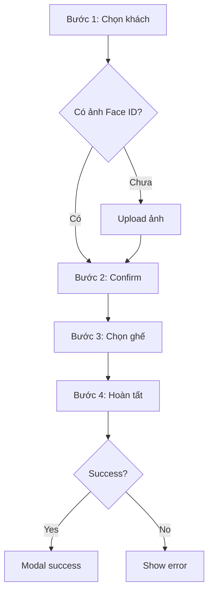

# 📝 Hướng Dẫn Đăng Ký Hộ

## 📋 Tổng Quan

Quy trình đăng ký hộ khách hàng tham gia sự kiện với 4 bước đơn giản.

**URL**: `/dang-ky-ho`

---

## 🔄 Quy Trình 4 Bước

### Bước 1: Chọn Khách Hàng
```
1. Tìm kiếm khách trong danh sách
   ├─ Search: Tên, Email, Chức vụ
   └─ Filter: Chưa đăng ký ghế
2. Click chọn khách
3. Hiển thị thông tin preview
4. Click "Tiếp tục" → Bước 2

Note: Chỉ hiển thị khách chưa đăng ký ghế
```

### Bước 2: Lấy Thông Tin & Face ID
```
1. Xem lại thông tin khách
2. Checkbox "Đồng ý điều khoản"*
3. Kiểm tra ảnh Face ID:
   ├─ Có ảnh → Continue
   └─ Chưa có → Upload required
4. Upload ảnh (nếu chưa có):
   ├─ Chọn file
   ├─ Preview
   └─ Validate khuôn mặt
5. Click "Tiếp tục" → Bước 3

Validation:
- ✅ Checkbox phải check
- ✅ Phải có ảnh (cũ hoặc mới)
```

### Bước 3: Chọn Ghế
```
1. Xem sơ đồ ghế
2. Click ghế muốn đặt
3. Xem thông tin:
   ├─ Số ghế
   ├─ Loại ghế
   └─ Giá
4. Xác nhận chọn
5. Click "Tiếp tục" → Bước 4
```

### Bước 4: Hoàn Tất
```
1. Review tổng quan:
   ├─ Thông tin khách
   ├─ Ghế đã chọn
   └─ Dịch vụ (optional)
2. Click "Hoàn tất đăng ký"
3. Xử lý:
   ├─ Upload Face ID (nếu có)
   ├─ Đăng ký ghế
   └─ Cập nhật thông tin
4. Success modal
5. Click "Hoàn tất" → Reset form
```

---

## ✨ Tính Năng Đặc Biệt

### Quick Add Customer
```
Tại Bước 1:
1. Click "Thêm khách mới"
2. Modal form nhanh
3. Điền thông tin cơ bản
4. Submit → Thêm vào danh sách
5. Tự động select khách mới
```

### Face ID Validation
```
- Kiểm tra ảnh tồn tại
- Upload nếu chưa có
- Validate khuôn mặt via API
- Preview trước khi confirm
```

### Seat Selection
```
- Visual seat map
- Màu sắc phân loại
- Real-time availability
- Hiển thị giá instant
```

---

## 💾 Flow Diagram



---

## 📝 API Calls

### Upload Face ID
```
POST /core/persons/valid-upload-face
Params: personId, acsDevIndexCode=90
Body: FormData (faceImage)
```

### Register Seat
```
POST /core/persons/registration
Body: {
  fullName, email, phone, position,
  seatInfo: { seatNumber, paidPrice },
  items: []
}
```

---

## 🔧 Troubleshooting

### Không Thấy Khách Trong Danh Sách
```
Check:
1. Khách đã có seatInfo?
2. Filter logic đúng?
3. API response OK?
```

### Upload Face ID Failed
```
Check:
1. File format (jpg, png)?
2. Size < 5MB?
3. personId valid?
4. API endpoint reachable?
```

### Không Chọn Được Ghế
```
Check:
1. Ghế AVAILABLE?
2. Không phải BLOCK?
3. Click handler OK?
```

---

## 💡 Tips

1. **Bước 1**: Filter khách chưa có ghế
2. **Bước 2**: Bắt buộc checkbox + ảnh
3. **Bước 3**: Chỉ ghế AVAILABLE
4. **Bước 4**: Review trước khi submit
5. **Success**: Clear form → restart

---

## ✅ Validation Rules

| Bước | Required | Validation |
|------|----------|------------|
| 1 | Chọn khách | Must select from list |
| 2 | Checkbox + Ảnh | Both required |
| 3 | Chọn ghế | AVAILABLE seat only |
| 4 | Review | All data complete |

---

<div align="center">
  📚 <a href="./STREAM_MANAGEMENT_GUIDE.md">← Link Trực Tuyến</a> | <a href="../README.md">Trang Chủ</a>
</div>
